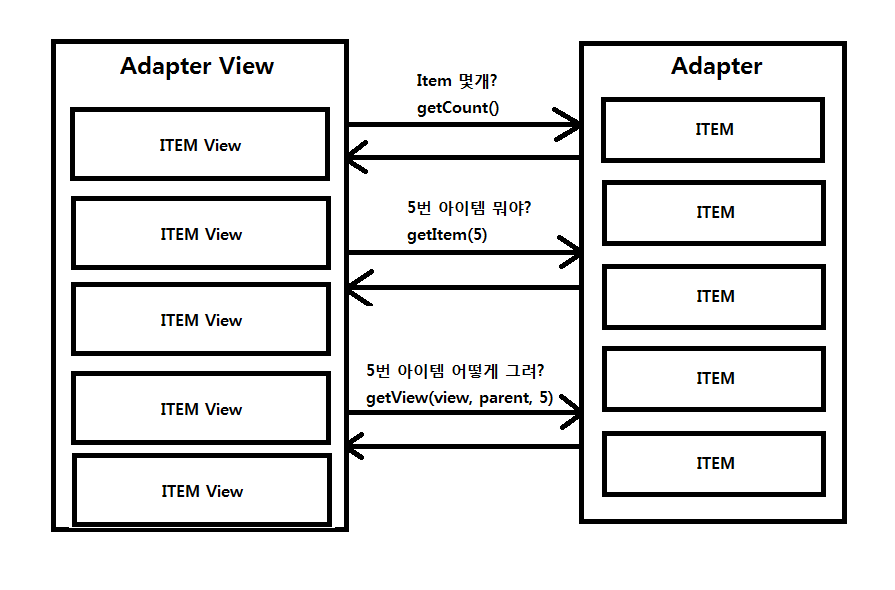

## AdapterView

> 뷰를 구성하기 위해 개발자가 코드를 통해 결정해줘야 하는 항목이 있는 뷰


- 어댑터 객체를 만들어서 어댑터 뷰의 주소를 담는다
    - setAdapter(어댑터 객체)





### 1. List View

> 여러 항목들을 제공하고 위아래로 스크롤하여 항목을 보여주는 뷰

- 항목의 개수, 항목 1개의 모양, 어떤 데이터 형식으로


#### 1.1 주요 메서드

- setAdapter : 리스트뷰를 구성하기 위한 어댑터 객체를 설정


#### 1.2 리스너

- OnItemClickListener : 항목을 터치하면 반응하는 리스너
    - onItemClick(어댑터뷰의 주소, 터치한 객체, int position(인덱스 번호), long id) { }


### 2. Custom ListView

- 항목 하나의 모양을 개발자가 직접 만들어 사용할 수 있다


#### 2.1 ArrayAdapter

> 항목 하나의 배치된 뷰 중 '값을 설정해야하는 뷰'가 TextView 하나라면 ArrayAdapter를 사용


1. 간단한 사용법

    - 눈에 보이는 레이아웃을 만들 땐 res의 layout 폴더에 xml 파일(Layout resource file)을 만들어서 사용


```java
// 전략

ArrayAdapter<String> adapter = new ArrayAdapter<String>(this, R.layout.row, R.id.textView, datas);
// 현재 액티비티, 데이터 항목 하나하나를 표현하기 위한 xml,( 커스텀 xml이라면 해당 뷰 id값,) 데이터list 또는 array
```


---


#### 2.2 SimpleAdapter

> 항목 하나에 배치된 뷰 중 2개 이상의 뷰에 데이터를 세팅해야 한다면 SimpleAdapter를 사용


1. 간단한 사용법

```java
// 전략
SimpleAdapter adapter = new SimpleAdapter(this, data_list, R.layout.row, keys, ids);
// 현재 액티비티, 데이터 배열, 레이아웃 파일, 해시맵 이름배열, 데이터를 넣을 아이디 배열
```


### 3. Tow Line ListView

- 리스트뷰 항목 하나에 두 가지 문자열을 보여줄 때 사용

    - SimpleAdapter 사용

- 항목 하나의 모양을 만들 때 사용할 레이아웃에 TextView가 2개 존재하도록 배치

- 안드로이드 OS 자체에서 제공하는 레이아웃 파일 사용

    - android.R.layout.simple_list_item_2


### 4. Spinner

> 사용자에게 항목을 주고 선택하게 할 수 있는 AdapterView

> 게시판 목록 선택하기 등


#### 4.1 spinner의 adapter


```java
// 어댑터 생성
// 기본 상태의 스피너
ArrayAdapter<String> adapter = new ArrayAdapter<String>(this, android.R.layout.simple_spinner_item, datas);

// 터치 시 드랍다운으로 나타나는 항목 리스트 뷰
adapter.setDropDownViewResource(android.R.layout.simple_spinner_dropdown_item);
```


#### 4.2 주요 메서드

- getSelectedItemPosition : 현재 선택된 항목의 인덱스 번호를 반환


#### 4.2 리스너

- OnItemSelectedListener : 스피너에서 항목을 선택했을 때 반응하는 리스너
  - onItemSelected : 사용자가 항목을 선택했을 때 호출되는 메서드
  - onNothingSelected


### ~~5. ViewPager~~

> ~~좌우로 스와이프 하며 View를 전환하는 AdapterView~~
>
> ~~화면이 바뀌는 것이 아닌 화면 크기의 뷰들이 전환되는 개념~~


#### ~~5.1 사용하기 위한 PagerAdapter~~

> ~~PagerAdapter를 구현하여 사용~~

- ~~오버라이드 함수~~
  - ~~getCount : ViewPager로 보여줄 뷰의 전체 개수~~
  - ~~isViewFromObject : instantiateItem에서 만든 객체를 사용할 것인이 여부~~
  - ~~instantiateItem : ViewPager로 보여줄 뷰 객체 반환~~
  - ~~destroyItem : ViewPager에서 뷰가 사라질 때 제거~~


### 5. ViewPager2

> 좌우 또는 상하로 스와이프 하며 View를 전환하는 AdapterView
>
> 화면이 바뀌는 것이 아닌 화면 크기의 뷰들이 전환되는 개념


#### 5.1 사용하기 위한 Adapter

##### 1. ViewPager의 PagerAdapter

> 뷰를 통해 페이징

- RecyclerView.Adapter
  - getItemCount : ViewPager로 보여줄 뷰의 전체 개수


##### 2. ViewPager의 FragmentPagerAdapter

> 정해진 소수의 프래그먼트를 통해 페이징

- FragmentStateAdapter
  - ~~getItem~~ createFragment


##### 3. ViewPager의 FragmentStatePagerAdapter

> 많은 수 또는 알 수 없는 프래그먼트를 통해 페이징

- FragmentStateAdapter


## Custom Adapter

> 리스트뷰를 사용할 때 특별한 기능을 추가해서 만들고 싶을 경우


- 만들고자 하는 Adapter 클래스는 BaseAdapter 클래스를 상속

    - getCount : 리스트뷰 내의 전체 항목의 개수 반환
        - return 10; 이라고 하면 안드로이드OS는 10개짜리 리스트뷰로 만듦
        - 그러므로 리스트 뷰의 항목의 개수를 결정해주는데 사용

    - getItem

    - getItemId

    - getView : 리스트 뷰 항목 하나를 구성하여 반환
        - 반환하는 뷰객체를 해당 리스트뷰의 항목으로 사용


### adapter 객체에서 어떤 버튼을 눌렀는지 알고 싶은 경우

- 리스너에서는 구분할 방법이 없다

- tag라는 것을 이용

1. 사용자가 Button을 누르면

2. 버튼에 세팅된 리스너가 onClick을 호출하면서 Button 객체가 (View v에 들어간다)

3. 그러므로 버튼 객체에 index 값을 저장해두면, 이를 리스너 내에서 사용할 수 있다

4. 사용 방법

```java
// 전략

public View getView(int position, View convertView, ViewGroup parent) {

// 중략

    Button btn = (Button)convertView.findViewById(R.id.button);

// 클릭 리스너 달아주고

    btn.setTag(position);	// setTag로 오브젝트(객체) 하나를 넣을 수 있다

// 중략

}


class BtnListener implements View.OnClickListener {

// 중략

    int position = (Integer).v.getTag();

// 중략

    text.setText("" + position);

// 하략
```


