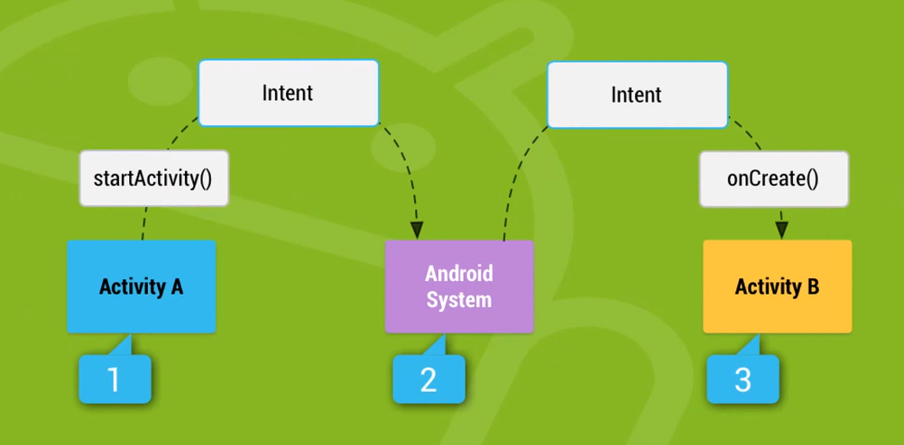

## 안드로이드 4대 구성요소

> 사용하고자 하는 구성요소를 AndroidManifest.xml에 기록

##### 하나의 애플리케이션은 독립된 실행단위인 4대 구성요소로 구성

> 필요한 것만 갖고 있어도 된다

- Activity : 화면을 관리하는 실행 단위

- Service : 백그라운드에서 실행되는 실행단위

- Broad Cast Receiver : OS가 전달하는 메시지를 전달 받아 실행하는 실행단위
    - 어떤 사건이 발생했을 때 사건에 관련된 메시지를 단말기의 어플리케이션들에게 전달함
    - 해당 어플에 브로드캐스트리시버가 있으면 여기에 작성한 코드들이 동작

- Contents Provider : 저장된 데이터를 제공하기 위한 실행단위
    - SQLite DB에 저장된 데이터를 다른 어플리케이션이 사용하고자 할 때 사용하는 것

### Intent

- 4대 구성 요소를 실행하기 위해서는 Intent 필요

- 개발자가 직접 실행하는 것이 아니라 OS에게 실행을 요청

- 실행요청을 전달받은 OS는 해당 실행 요소를 실행
    - 이를 위한 정보를 담는 객체 Intent

### 액티비티 실행하기

- 애플리케이션을 실행하면 AndroidManifest.xml에서 intent-filter의 name이 android.intent.action.MAIN으로 주어진 Activity를 우선적으로 실행하게 된다

- startActivity : 지정된 Intent에 담긴 정보를 토대로 Activity를 실행

- finish : 현재 실행하고 있는 Activity를 종료한다

#### Back Stack

- Activity에서 다른 Acitivity를 실행하면 이전 Activity는 Back Stack에 담겨 정지 상태가 되고 새로 실행된 Activity가 활동

- 새로 실행된 Activity가 제거되면 Back Stack에 있던 Activity가 다시 활동
    - 최초의 Activity까지 제거되면 어플리케이션이 종료

### OnResultActivity

#### startActivityForResult

- Activity에서 다른 Activity를 실행하고 다시 돌아왔을 때 어떤 처리가 필요하다면 다른 Activity를 실행할 때 startActivity가 아닌 startActivityForResult 메서드를 사용

#### onActivityResult

- startActivityForResult 메서드를 이용해 Acitivity를 실행하고 돌아오면 자동으로 onActivityResult 메서드 호출
    - 이 부분에서 필요한 작업을 실행

### 데이터 전달하기

#### Intent에 데이터 세팅하기

- Intent 객체에 putExtra 메서드를 이용하여 데이터를 세팅하면 다음 실행할 Activity에 데이터를 전달할 수 있다

- putExtra 메서드는 자료형 별로 메서드가 제공되므로 타입을 가리지 않는다

#### Intent에서 데이터 가져오기

- Intent에 세팅된 데이터는 get자료형Extra 메서드를 이용해 가져온다

