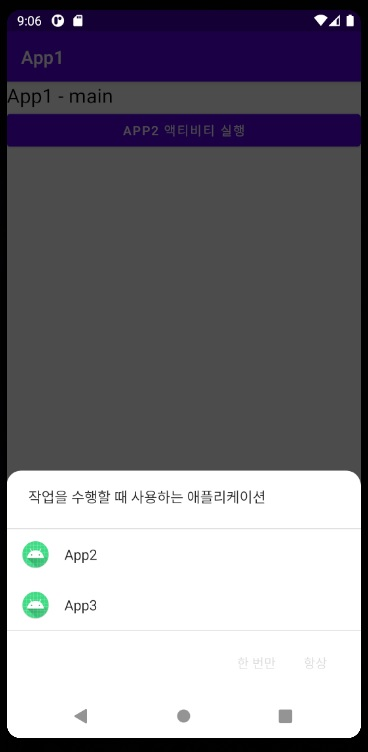
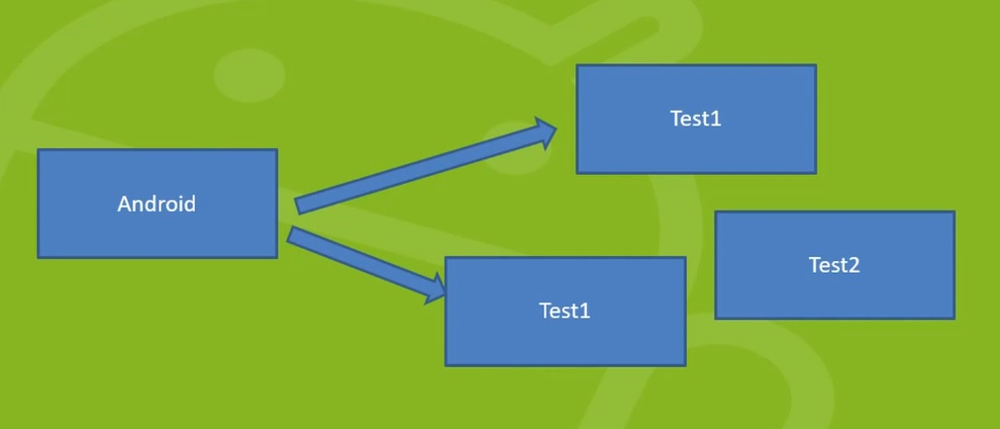

## 안드로이드 4대 구성요소

> 사용하고자 하는 구성요소를 AndroidManifest.xml에 기록

##### 하나의 애플리케이션은 독립된 실행단위인 4대 구성요소로 구성

> 필요한 것만 갖고 있어도 된다

- Activity : 화면을 관리하는 실행 단위

- Service : 백그라운드에서 실행되는 실행단위

- Broad Cast Receiver : OS가 전달하는 메시지를 전달 받아 실행하는 실행단위
    - 어떤 사건이 발생했을 때 사건에 관련된 메시지를 단말기의 어플리케이션들에게 전달함
    - 해당 어플에 브로드캐스트리시버가 있으면 여기에 작성한 코드들이 동작

- Contents Provider : 저장된 데이터를 제공하기 위한 실행단위
    - SQLite DB에 저장된 데이터를 다른 어플리케이션이 사용하고자 할 때 사용하는 것

### 0. Intent

- 4대 구성 요소를 실행하기 위해서는 Intent 필요

- 개발자가 직접 실행하는 것이 아니라 OS에게 실행을 요청

- 실행요청을 전달받은 OS는 해당 실행 요소를 실행
    - 이를 위한 정보를 담는 객체 Intent

### 1. 액티비티 실행하기

- 애플리케이션을 실행하면 AndroidManifest.xml에서 intent-filter의 name이 android.intent.action.MAIN으로 주어진 Activity를 우선적으로 실행하게 된다

- startActivity : 지정된 Intent에 담긴 정보를 토대로 Activity를 실행

- finish : 현재 실행하고 있는 Activity를 종료한다

#### Back Stack

- Activity에서 다른 Acitivity를 실행하면 이전 Activity는 Back Stack에 담겨 정지 상태가 되고 새로 실행된 Activity가 활동

- 새로 실행된 Activity가 제거되면 Back Stack에 있던 Activity가 다시 활동
    - 최초의 Activity까지 제거되면 어플리케이션이 종료

### 2. OnResultActivity

#### startActivityForResult

- Activity에서 다른 Activity를 실행하고 다시 돌아왔을 때 어떤 처리가 필요하다면 다른 Activity를 실행할 때 startActivity가 아닌 startActivityForResult 메서드를 사용

#### onActivityResult

- startActivityForResult 메서드를 이용해 Acitivity를 실행하고 돌아오면 자동으로 onActivityResult 메서드 호출
    - 이 부분에서 필요한 작업을 실행

### 3. 데이터 전달하기

#### Intent에 데이터 세팅하기

- Intent 객체에 putExtra 메서드를 이용하여 데이터를 세팅하면 다음 실행할 Activity에 데이터를 전달할 수 있다

- putExtra 메서드는 자료형 별로 메서드가 제공되므로 타입을 가리지 않는다

#### Intent에서 데이터 가져오기

- Intent에 세팅된 데이터는 get자료형Extra 메서드를 이용해 가져온다

### 4. 객체 전달하기

> 정확히는 객체를 전달하는 것이 아니라, Intent에 객체를 구성하는 데 필요한 데이터를 담아 Parcel로 다른 액티비티에 전달하고, 전달받은 액티비티에서 새로 객체를 만들어 Parcel에 담긴 데이터를 담는 것이다

#### 4.1 Parcelable

- Intent를 통해 객체를 전달할 때는 Parcleable 인터페이스를 구현한 객체만 가능
- Parcelable 인터페이스는 전달받은 쪽에서 객체를 복원할 때 필요한 정보를 가진 부분을 의미한다

##### 4.1.1 Override Method

- writeToParcel : 객체를 Intent에 담을 때 자동으로 호출되는 메서드
  - 첫 번째 매개 변수로 들어오는 Parcel 객체에 객체 복원을 위해 필요한 정보를 담는다
- describeContents

### 5. 다른 애플리케이션의 액티비티 사용하기

#### 5.1 Intent Filter

- 안드로이드의 4대 구성요소는 모두 AndroidManifest.xml에 기록되어야 한다
- 다른 애플리케이션을 실행할 수 있도록 하려면 Intent Filter를 이용해 이름을 설정해주면 된다

- 만약 여러 개의 동일한 이름의 액티비티가 있는 경우, 실행할 액티비티를 선택하라고 한다

  

### 6. Activity Action

- 안드로이드에서 제공되는 기본 애플리케이션 중 다른 애플리케이션이 사용할 수 있도록 Activity가 제공하는 것들이 있다

### 7. Broad Cast Receiver

- 위 상황에서, Test1이라는 메시지에 반응하는 Receiver는 2개가 있으므로 이 코드들이 같이 작동한다

#### 7.1 명시적 인텐트

- 안드로이드의 4대 구성 요소 중 하나의 동작을 위해 동작하고자 하는 구성 요소의 클래스명을 직접 기술하여 동작하는 것
- 한 번에 하나만 실행 가능

#### 7.2 암시적 인텐트

- 안드로이드의 4대 구성 요소 중 원하는 구성요소를 실행하기 위해 Intent Filter를 통해 설정한 이름을 이용하는 것
- 동일한 이름이 여러 개 있을 경우에는 Activity인 경우에는 선택하여 실행, 그 오의 경우에는 모두 실행한다

##### 7.2.1 안드로이드 8.0 이후 제약사항

- 안드로이드는 높은 하드웨어 사양을 요구한다는 단점이 있음
- 일부를 제외한 모든 Broad Cast Receiver는 암시적 인텐트로 실행할 경우 반드시 코드를 통해 리시버를 등록하는 작업을 해야한 가능
  - Broad Cast Receiver를 소유한 애플리케이션이 실행 중에만 사용할 수 있도록 제한

### 8. 시스템 메시지

> https://developer.android.com/guide/components/broadcast-exceptions.html

- 단말기에서 사건이 발생했을 경우 각 사건마다 정해놓은 이름으로 시스템 메시지를 발생
- 이 메시지와 동일한 이름으로 설정된 Broad Cast Receiver를 찾아 개발자의 코드 동작 가능
- 안드로이드 8.0부터는 사용할 수 있는 시스템 메시지의 수가 감소

- 시스템 메시지 관련은 권한을 주어야 하는 경우가 많음

