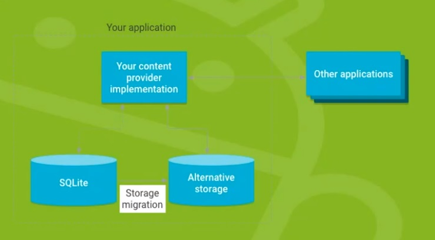

## 안드로이드 저장소

> 안드로이드 10부터 접근 방식이 달라졌으니 확인 요망


- 안드로이드는 애플리케이션이 데이터를 저장할 수 있는 저장소를 2가지로 제공

- 내부 저장소 : 애플리케이션을 통해서만 접근 가능

- 외부 저장소 : 단말기 내부의 공유 영역, 모든 애플리케이션이 접근 가능. 단말기를 컴퓨터에 연결하면 탐색기를 통해 접근할 수 있는 영역


### 1. 파일 입출력

- 내부 저장소 : openFileOutput, openFileInput

- 외부 저장소 : FileInputStream, FileOutputStream
    - `android/data/패지키명` 폴더에 저장하면 애플리케이션 삭제 시 같이 삭제된다

    - `mnt/sdcard/`, `sdcard/`, `storage/emulated`가 같은 영역을 의미한다


### 2. SQLite 데이터 베이스

- 안드로이드에서 사용하는 내장 데이터베이스
    - 표준 SQL문을 사용하는 관계형 데이터 베이스

- MySQL과 유사한 문법, 일반적인 관계형 데이터베이스가 갖고 있는 기능 사용 가능

- SQLiteOpenHelper라는 클래스를 상속받은 클래스를 먼저 만들어야 한다
    - 어떠한 DB를 이용할 것인지 결정

    - DB가 처음 만들어졌을 때 처리할 일, DB 구조가 변경되었을 때 처리할 일들을 할 수 있도록 제공

- 애플리케이션을 삭제하면 같이 삭제된다


#### 2.1 CRUD

```java
public void insertMyData(View view) {
    // 데이터베이스 오픈
    DBHelper helper = new DBHelper(this);
    SQLiteDatabase db = helper.getWritableDatabase();

    String sql = "INSERT INTO TestTable (textData, intData, floatData, dateData) "
            + "VALUES (?, ?, ?, ?);";

    // 날짜는 2021-02-25 이런 식으로 제공하자
    // 데이터 준비
    SimpleDateFormat sdf = new SimpleDateFormat("yyyy-MM-dd", Locale.getDefault());
    String date = sdf.format(new Date());

    // ?에 바인딩될 값 배열
    String[] arg1 = {"문자열1", "100", "11.11", date};
    String[] arg2 = {"문자열2", "200", "22.22", date};

    // 저장한다
    db.execSQL(sql, arg1);
    db.execSQL(sql, arg2);

    db.close();

    text1.setText("저장완료");
}


public void selectMyData(View view) {
    DBHelper helper = new DBHelper(this);
    SQLiteDatabase db = helper.getWritableDatabase();

    // 조건절이 있다면 조건절에 들어갈 값을 ?로 세팅한 다음
    // ?에 들어갈 값을 2번째 패러미터로 넣어주면 된다
    String sql = "SELECT * FROM TestTable;";    // WHERE idx = ?
    // String[] arg1 = {"1"};

    // SELECT 쿼리 실행
    // 가져온 결과에 접근할 수 있는 객체가 Cursor 객체
    Cursor c = db.rawQuery(sql, null);  // 그 후 null 대신 arg1

    text1.setText("");

    // 선택된 rows를 끝까지 반복하여 데이터를 가져온다
    while (c.moveToNext()) {
        // 컬럼의 이름을 갖고 데이터를 가져오는 방법이 없다
        // SELECT로 가져온 데이터 중에서 index 번호를 갖고 몇 번째 컬럼의 데이터를 가져오라
        // 이런 식으로 처리해야 한다
        // 컬럼의 이름만 알고 몇 번째로 나오는지 모르는 경우,
        // 컬럼의 이름으로 index 번호를 추출한 다음 index 번호를 통해서 데이터를 가져와야 한다
        int idx_pos = c.getColumnIndex("idx");
        int textData_pos = c.getColumnIndex("textData");
        int intData_pos = c.getColumnIndex("intData");
        int floatData_pos = c.getColumnIndex("floatData");
        int dateData_pos = c.getColumnIndex("dateData");

        // 컬럼 인덱스 번호를 통해 데이터를 가져온다
        int idx = c.getInt(idx_pos);
        String textData = c.getString(textData_pos);
        int intData = c.getInt(intData_pos);
        double floatData = c.getFloat(floatData_pos);
        String dateData = c.getString(dateData_pos);

        text1.append("idx : " + idx + "\ntextData : " + textData);
        text1.append("\nintData : " + intData + "\nfloatData : " + floatData);
        text1.append("\ndateDate : " + dateData + "\n\n");
    }

    db.close();
}


public void updateMyData(View view) {
    DBHelper helper = new DBHelper(this);
    SQLiteDatabase db = helper.getWritableDatabase();

    String sql = "UPDATE TestTable SET textData = ? WHERE idx = ?;";
    String[] args = {"문자열3", "1"};

    db.execSQL(sql, args);
    db.close();

    text1.setText("수정완료");
}


public void deleteMyData(View view) {
    DBHelper helper = new DBHelper(this);
    SQLiteDatabase db = helper.getWritableDatabase();

    String sql = "DELETE FROM TestTable WHERE idx=?;";
    String[] args = {"1"};

    db.execSQL(sql, args);
    db.close();

    text1.setText("삭제완료");
}
```


### 3. SQLite 데이터 베이스 2

- 안드로이드는 SQLite를 사용할 때 포쥰 SQL 쿼리문 대신 사용할 수 있는 클래스 제공


#### 3.1 CRUD

```java
public void insertMyData(View view) {
    DBHelper helper = new DBHelper(this);
    SQLiteDatabase db = helper.getWritableDatabase();

    SimpleDateFormat sdf = new SimpleDateFormat("yyyy-MM-dd", Locale.getDefault());
    String date = sdf.format(new Date());

    // 컬럼에 저장할 데이터를 관리할 객체
    // 컬럼명, 데이터
    ContentValues cv1 = new ContentValues();
    cv1.put("textData", "문자열1");
    cv1.put("intData", 100);
    cv1.put("floatData", 11.11);
    cv1.put("dateData", date);

    // 테이블명, 값을 추가하지 않았을 경우 들어갈 기본값, 데이터들을 담은 객체
    db.insert("TestTable", null, cv1);

    ContentValues cv2 = new ContentValues();
    cv2.put("textData", "문자열2");
    cv2.put("intData", 200);
    cv2.put("floatData", 22.22);
    cv2.put("dateData", date);

    db.insert("TestTable", null, cv2);

    db.close();
    text1.setText("저장완료");
}


public void selectMyData(View view) {
    DBHelper helper = new DBHelper(this);
    SQLiteDatabase db = helper.getWritableDatabase();

    // 첫 번째 : 데이터를 가져올 테이블 이름
    // 두 번째 : 가져올 컬럼의 이름이 담긴 문자열 배열. null은 *
    // 세 번째 : 조건절. 없으면 null, 값이 들어갈 부분은 ?
    // 네 번째 : 조건절의 ?에 바인딩 될 값의 배열
    // 다섯 번째 : GROUP BY절의 기준 컬럼
    // 여섯 번째 : having절에 들어갈 조건절
    // 일곱 번째 : 정렬 기준. 오름차순, 내림차순
    Cursor c = db.query("TestTable", null, null, null, null, null, null);

    text1.setText("");

    while (c.moveToNext()) {
        int idx_pos = c.getColumnIndex("idx");
        int text_pos = c.getColumnIndex("textData");
        int int_pos = c.getColumnIndex("intData");
        int float_pos = c.getColumnIndex("floatData");
        int date_pos = c.getColumnIndex("dateData");

        int idx = c.getInt(idx_pos);
        String textData = c.getString(text_pos);
        int intData = c.getInt(int_pos);
        double floatData = c.getFloat(float_pos);
        String dateData = c.getString(date_pos);

        text1.append("idx : " + idx + "\ntextData : " + textData);
        text1.append("\nintData : " + intData + "\nfloatData : " + floatData);
        text1.append("\ndateData : " + dateData + "\n\n");
    }
    db.close();
}


public void updateMyData(View view) {
    DBHelper helper = new DBHelper(this);
    SQLiteDatabase db = helper.getWritableDatabase();

    ContentValues cv = new ContentValues();
    cv.put("textData", "문자열3");

    String where = "idx=?";
    String[] args = {"1"};

    // 테이블명, 수정할 데이터 관리 객체, 조건절, 조건절 항목
    db.update("TestTable", cv, where, args);
    db.close();

    text1.setText("수정완료");
}


public void deleteMyData(View view) {
    DBHelper helper = new DBHelper(this);
    SQLiteDatabase db = helper.getWritableDatabase();

    String where = "idx=?";
    String[] args = {"1"};
    
    // 테이블명, 조건절, 조건절 항목
    db.delete("TestTable", where, args);
    db.close();
    
    text1.setText("삭제완료");
}
```


### 4. Content Provider



- 안드로이드 4대 구성요소
- 애플리케이션이 저장한 데이터를 다른 애플리케이션이 사용할 수 있도록 제공하는 개념
- Content provider에 SQLite DB에 접근하여 데이터를 조작할 수 있는 메서드를 작성하고, Content provider에 name을 부여하면 외부 애플리케이션에서 해당 name을 통해 메서드를 호출한다
  - INSERT, SELECT, UPDATE, DELETE 관련 메서드를 오버라이딩 해야함


- 외부 앱에서 해당 앱의 provider에 접근하려면 안드로이드 10부터는 다음과 같은 코드를 Manifest.xml에 추가해야 한다

  ```xml
  <manifest>
  	<queries>
          <provider android:authorities="com.ssafy.dbprovider" />
      </queries>
      
      <!-- 중략 -->
      
  </manifest>
  ```

  


### 5. 리소스 관리

- 애플리케이션에서 사용하는 다양한 값을 코드에 직접 작성하지 않고 xml을 통해 관리할 수 있도록 제공
- xml을 통해 사용할 수 있으므로 단말기의 상태(크기, 해상도, 언어 등)에 따라 다양하게 대응할 수 있고 유지보수에 용이


#### 5.1 문자열 관리

- 문자열, 문자열 배열을 xml에 등록하여 사용 가능
- 다국어 지원을 위해 사용


#### 5.2 색상 관리


#### 5.3 크기 관리

- 크기를 xml에 등록하여 사용가능
- 모든 디스플레이 장비는 px이라는 단위로 크기 등을 결정
- 안드로이드 기기는 다양하므로 px를 사용하면 크기가 다르게 나타난다
- 가변형 단위를 사용


##### 5.3.1 단위

> 단위값 없이 숫자만 쓰면 기본적으로 dp로 인식함

- px : 실제 사용할 픽셀의 개수
- dp : 160ppi 액정에서 1dp = 1px
  - 10dp 길이 → 160ppi 액정에서는 10px로 그림
  - 10dp 길이 → 320ppi 액정에서는 20px로 그림
- sp : 단말기에 설정되어 있는 글자 크기에 따라 가변
  - 기본 크기면 160ppi 액정에서 1sp = 1px
- mm : 밀리미터
- in : 인치
- pt = 1pt = 1/72인치


### 6. 이미지 리소스

- drawable 폴더에 이미지를 넣어서 이미지 사용 가능
- xml을 통해 이미지를 새롭게 구성하여 사용 가능
  - 여러 이미지를 겹쳐 하나의 이미지로 만들 때
  - 패턴 이미지를 만들 때
  - 상태에 따른 이미지를 만들 때
  - 기타 등등


#### 6.1 selector

> 상태에 따라 이미지를 변경하고자 할 때 사용

- state_상태="조건"
- 단, 아무런 상태가 지정되지 않은 기본 조건을 가장 마지막에 배치해야 위의 상태가 적용된다


### 7. 지역화

- 하나의 애플리케이션을 다양한 언어 및 국가를 지원하기 위한 개념
- res 폴더의 resource 폴더에 국가 코드를 추가하여 지역화를 할 수 있다
  - 언어 안에서 지역 별로 나눌 수도 있다


### 8. 해상도 대응

- 단말기의 해상도에 따라 이미지를 선택하여 그림을 그릴 수 있도록 할 수 있다
- 고해상도 단말기에서 보다 선명한 이미지를 보여주는 목적으로 사용


#### 8.1 해상도에 따른 분류

- ldpi : ~ 120 dpi
- mdpi : 121 ~ 160 dpi
- hpdi : 161 ~ 240 dpi
- xhdpi : 241 ~ 320 dpi
- xxhdpi : 321 ~ 480 dpi
- xxxhdpi : 481 ~ 640 dpi


#### 8.2 적용

1. 단말기 해상도에 해당하는 폴더에 이미지가 있을 경우 원본크기 그대로 그린다
2. 해상도에 해당하는 디렉토리에 이미지가 없을 경우 인접한 해상도 폴더의 이미지를 가져와 적당한 배율로 확대 또는 축소해서 그린다
3. 인접한 해상도 폴더에 이미지가 없을 경우 drawable 폴더의 이미지를 확대 또는 축소해서 그린다


### 9. 뷰 복원

- 화면 회전이 발생하면 화면을 새롭게 만든다
- 일부 UI 요소들은 초기값으로 설정되기 때문에 복원해야 한다
- onSaveInstanceState 메서드에 복원 시 필요한 값을 저장
- onCreate 메서드에서 복원 작업


#### 9.1 회전에 따른 화면 적용

- layout 폴더에 수식어를 추가
  - layout-port : 세로 화면
    - layout으로 대체 가능
  - layout-land : 가로 화면


#### 9.2 화면 회전 막기

- Manifest.xml의 Activity 태그에 screenOrientation 속성으로 설정

  ```xml
  <activity android:name=".MainActivity"
              android:screenOrientation="portrait">
  <!-- 이하 생략 -->
  ```

  


