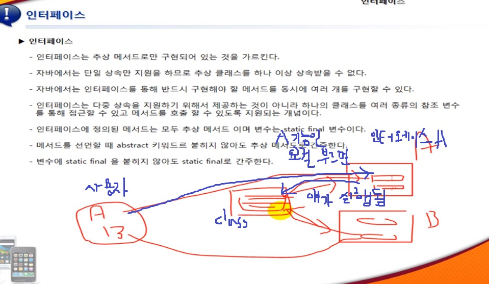

## 1. 생성자

### 생성자

- 생성자는 Java 클래스에서 객체를 생성할 때 자동으로 호출되는 메서드

- return type이 없으며 메서드의 이름은 클래스의 이름과 동일하다

- 객체 생성 때 반드시 수행되어야 하는 경우
    - 초기화 작업 등


#### 사용 양식

```
public 클래스명( 매개변수 ) {
    코드
}
```


### 생성자의 Overloading

#### default 생성자

- 생성자를 클래스에 만들지 않으면 매개 변수가 없는 생성자가 자동으로 만들어지며 내부에는 소스 코드가 없다


#### 매개 변수가 있는 생성자

- 생성자는 매개 변수를 가질 수 있으며 매개 변수가 있는 생성자를 만들 경우 default 생성자가 생성되지 않는다

- 매개 변수의 형태를 다르게 하여 여러 개의 생성자를 생성할 수 있으며 객체를 생성할 때 선택할 수 있다


## 2. 상속

### 상속

- 클래스를 만들 때 다른 클래스가 갖고 있는 메서드 혹은 변수를 가져와서 사용하는 방법

- 참조와는 달리 메서드와 변수를 물려받아 자신의 것처럼 사용

- 기존에 만든 클래스에 새로운 기능을 추가하거나 이미 만들어진 메서드를 다시 구현할 경우 사용

- 자바는 단일 상속만을 지원

- 직접 상속시킨 클래스가 없다면 Object를 자동으로 상속


#### 부모와 자식

- 물려주는 쪽을 부모클래스

- 받는 쪽을 자식클래스


#### 문법

> extends

```
class 클래스이름 extends 부모클래스
```


- 그 원리에 따라 상속하는 쪽이 더 넓은 범위를 갖게 됨

- 부모클래스의 생성자를 이용하겠다면, super(); 호출로도 충분하다


### 메소드의 Overriding

#### Overriding

- 부모 클래스가 갖고 있는 메서드를 자식 클래스에서 다시 구현

- Overriding한 경우 부모클래스의 메서드를 호출할 때는 super를 이용
    - 동일한 메서드의 이름이라면, super.메서드이름


## 3. 접근제한자

- 프로그램을 제작하다보면 클래스에 선언한 변수나 메소드를 접근하지 못하도록 막아야 할 경우가 있다

- 캡슐화의 개념에 적용되므로 아주 중요한 개념

- 클래스 : public, default
    - default는 접근제한자를 적지 않음

- 생성자 : public, protected, default, private

- 멤버 변수 : public, protected, default, private

- 멤버 메서드 : public, protected, default, private

- 지역 변수 : 접근 제한자 불가


### 클래스의 접근 제한자

- 저장하는 파일의 파일명을 결정하는데 사용

- 하나의 자바 파일에 여러 개의 클래스를 만들 경우 파일명으로 사용하는 이름은 public이 있는 클래스의 이름
    - 오직 하나의 클래스에만 public을 붙일 수 있다
    - public 붙은 클래스가 없다면 아무 이름으로나 사용할 수 있다


### 생성자, 메서드, 멤버 변수

#### public 접근제한자

- 아무 제약없이 자유롭게 접근이 가능한 접근 제한자


#### protected 접근제한자

- 패키지가 다르고 참조할 경우에만 접근이 불가능

- 패키지가 다른 경우에는 상속에 의해서는 접근이 가능하다


#### default 접근제한자

- 패키지가 다르면 접근이 불가능


#### private 접근제한자

- 모두 접근이 불가능

- 자기 자신 내부에서만 독립적으로 이용할 수 있다


## 4. 캡슐화

> 클래스에 선언한 변수의 접근제한자를 private로 주고 접근을 못하게 차단한 뒤, 접근을 가능하도록 허용한 변수만 메서드를 통해 접근하도록 하는 방법


### 접근을 위한 메서드

- Setter
    - 멤버 변수에 값을 넣기 위해 제공하는 메서드

- Getter
    - 멤버 변수의 값을 가져오기 위해 제공하는 메서드


## 5. Static

- 변수나 메서드에 Static을 붙여주면 객체의 생성 없이 사용할 수 있다

- 같은 클래스로부터 생성된 모든 객체들은 Static 변수를 개별적으로 가질 수 없으며 하나의 변수를 공용으로 사용

- static 메서드에서 사용할 수 있는 멤버변수는 static 뿐
    - 일반 변수들은 객체를 생성해야만 사용 가능
    - 물론 지역변수는 사용할 수 있다


## 6. Final

- 더 이상 변경할 수 없다

- 변수 : 변수에 값을 넣을 수 없으며 변수의 선언과 동시에 초기화를 해줘야 한다

- 메서드 : 상속관계에 있을 때 자식 클래스에서 메서드를 Overriding 할 수 없다

- 클래스 : 상속을 하지 못하도록 막을 수 있다


## 7. 중첩클래스

- 클래스 내부에 클래스를 만들어서 사용
- 여러 군데서 사용하는 클래스가 아닌 경우 (중요)
- 객체를 생성할 수 있는 부분을 클래스를 설계한 부분으로 한정할 경우
- 내부의 클래스를 Inner Class, 이를 밖에서 감싼 Class를 Outer Class


#### 일반 중첩 클래스

- 클래스 내부에 클래스를 만들어서 사용
- Inner 클래스는 Outer 클래스의 멤버에 접근할 수 있지만 Outer 클래스는 Inner 클래스의 멤버에 접근할 수 없다


#### static 중첩 클래스

- 일반 중첩 클래스에서 Inner 클래스가 static으로 정의된 경우
- Outer 클래스의 객체 생성 없이 바로 Inner 클래스의 객체 생성이 가능
- Inner 클래스에서는 Outer 클래스에 정의된 static 멤버만 접근할 수 있다


#### 메서드 내부의 중첩 클래스

- 클래스를 메서드 내부에 만든 경우
- 메서드 내부에 만든 중첩 클래스는 다른 곳에서 참조변수조차 선언할 수 없다

- Inner 클래스에서는 클래스 내부에 선언한 변수만 사용할 수 있다
  - Outer 클래스의 final 변수는 사용할 수 있다


#### 익명 중첩 클래스

- 클래스 내부 코드를 바로 작성하는 것
- 원본 클래스가 가지고 있는 메서드를 Overriding 해야할 경우, 상속받은 클래스를 만들지 않고 바로 Overriding을 할 수 있다
  - 매번 Overriding 해야하는 경우에는 편하다


## 8. 추상 클래스

### 추상 메서드

- 클래스를 작성할 때 내부를 구현하지 않고 선언한 해 놓은 메서드
- 해당 메서드를 구현한 뒤에만 사용할 수 있다
- 접근 제한자와 리턴 타입 중간에 abstract 라는 키워드를 넣는다


#### 구현된 메서드

> public void method() {}


#### 구현되지 않은 메서드

> public abstract void method();


### 추상 클래스

- 추상 메서드를 하나라도 가진 클래스
- 직접 객체 생성할 수 없다
- 추상 클래스를 상속받는 서브 클래스가 존재하여 서브 클래스를 사용해야 한다
  - 서브 클래스는 반드시 추상 메서드를 구현해야 한다
- 접근 제한자와 class 키워드 사이에 abstract를 넣는다


`public abstract class ClassName {}`


## 9. 인터페이스

### 인터페이스

> 자바 가상 머신이 어떠한 상황에서는 어떠한 추상 메서드를 사용한다고 알려주고, 
>
> 개발자는 어떠한 상황에서 실행되기를 바라는 기능을 어떠한 추상 메서드에 정의해두면
>
> 실행하게 되는 방식

- 추상 메서드로만 구현되어 있는 것
- 자바 특성 때문에 추상 클래스를 하나 이상 상속받을 수 없다
- 인터페이스를 통해 반드시 구현해야할 메서드를 동시에 여러 개를 구현할 수 있다
  - 절대 상속은 아니다


#### 작동 방식




1. class 하나 선언
2. 인터페이스 A, B에는 구현해야하는 추상메서드가 있다
3. class가 A, B의 추상메서드를 구현한다
4. A의 추상메서드를 호출하면, class의 A의 추상메서드가 호출된다
5. B의 추상메서드를 호출하면, class의 B의 추상메서드가 호출된다


- 하나의 클래스를 여러 종류의 참조 변수를 통해 접근할 수 있고 메서드를 호출할 수 있도록 지원되는 개념이다
- 인터페이스에 정의된 메서드를 모두 추상메서드이며 변수는 static final 변수다
  - 메서드를 선언할 때 abstract 키워드를 넣지 않아도 추상 메서드로 간주
  - 변수에 static final을 넣지 않아도 static final로 간주
    - interface를 구현한 클래스 없이도 인터페이스.변수로 접근할 수 있다


#### 인터페이스의 작성

```java
interface 인터페이스이름 {
	변수 선언
    메서드 선언
}
```


#### 인터페이스의 구현

```java
class 클래스이름 extends 부모클래스 implements 인터페이스1, 인터페이스2 {}
```


- 인터페이스는 인터페이스를 상속할 수 있다
- 클래스는 인터페이스를 상속할 수 없다