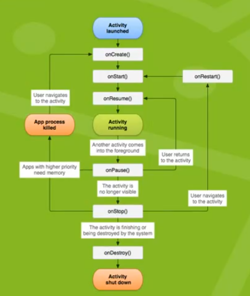

# 안드로이드 4대 구성요소

1. Activity

- 눈에 보이는 화면을 관리하는 실행단위

ex) 앱 실행시 로그인탭이 떠올라서 로그인을 하라고 요구할 때 등


2. Service

> 화면을 갖고 있지 않은 실행단위

- 안드로이드 어플 실행 중이 아니더라도 서비스를 만들어서 어플에 포함하면, 백그라운드에 있는 동안에 프로세스 수행 가능


3. Broadcast Receiver

- 시스템을 감시하고 있다가 시스템에서 어떤 사건이 발생하면 이를 처리하는 역할


4. Content Provider

- 데이터를 공유할 수 있는 실행단위


## 1. Activity

> 현재 보이는 화면을 관리하는 실행 단위

- 애플리케이션을 실행하면 Activity가 실행되고 Activity가 관리하는 화면이 나타나게 된다
    - 첫 번째 화면을 관리하는 Activity가 실행되어 화면을 보여준다
    - 두 번째 화면을 위한 동작을 하면 첫 번째 화면은 백그라운드로 가고, 두 번째 화면을 위한 Activity가 실행되어 화면을 보여준다


### 1.1 Activity 생명주기




- onCreate
  - Activity가 생성될 때 호출
  - 화면 회전이 발생했을 때 호출


# 안드로이드의 구조


- 메시지 확인을 위해 제공하는 `LogCat` : 메시지마다 이름 별로 구분할 수 있도록

```java
//Log.i // 정보 출력시
// Log.e // 에러 출력시
import android.util.Log;

Log.d(String tag, String message);
```


## 1. AndroidManifest.xml

> 개발자가 안드로이드 OS에게 애플리케이션의 성격을 알려주는 목적으로 사용하는 파일

> 안드로이드 OS는 이 파일을 분석하여 애플리케이션를 정리한다

- 안드로이드 개발 시 가장 중요한 파일

- 안드로이드 4대 구성요소의 정보를 모두 기록해야 한다


### 1.1 내부 코드

```xml
android:allowBackup="true"		<!-- 애플리케이션에 대한 백업 가능여부 -->

android:icon="@mipmap/ic_launcher"		<!-- 아이콘 이미지 -->

android:roundIcon="@mipmap/ic_launcher_round"		<!-- 둥근 아이콘 이미지 -->

android:label="Activity"		<!-- 애플의 문자열, 이름 -->

<activity android:name="액티비티이름">		<!-- 각 화면마다 activity 1개가 필요하다
										".MainActivity"는 첫 실행 시 메인 화면 -->
    <intent-filter>			<!-- 각각의 Activity에서 intent-filter를 찾는다
						 	안드로이드 4대 구성요소에 사용할 수 있는 도구
						 	안드로이드 4대 구성요소 각각에 이름을 부여하는 용도
						 	안드로이드 OS가 알고 있는 이름으로 부여하면 해당 특정 상황이 발생했을 때 실행하게 된다 -->
        <action android:name="android.intent.action.MAIN" />
        	<!-- 사용자가 안드로이드 애플리케이션 사용을 위해서 터치하면 실행되는 activity에 부여하는 이름
 			 오직 하나만 존재해야 하며, 여러 개가 있더라고 해도 맨 위의 하나만 실행된다 -->
        	<!-- 이 intent-filter를 찾으면 해당 activity의 액티비티이름을 읽는다
 			 이 액티비티이름이 현재 activity를 관리하는 java class의 이름이다 -->
        	<!-- 해당 java class의 객체를 생성하여 onCreate 메서드를 실행한다 -->

        <category android:name="android.intent.category.LAUNCHER" />
    </intent-filter>
</activity>
```


```java
protected void onCreate(Bundle savedInstanceState) {
    super.onCreate(saveInstanceState);
    setContentView(R.layout.activity_main);	// R(res폴더).layout(res폴더 하위 layout폴더).activity_main(layout폴더 하위 activity_main.xml파일)
    	// res 폴더의 파일을 손쉽게 관리하기 위함
    	// 저 폴더 경로의 activty_main.xml을 분석하여 화면을 출력한다
    	// R.layout.activity_main과 같은 부분을 리소스 ID라고 부른다
}
```


