# 안드로이드 앱 프로그래밍

## 1. 시작

### 1.1 프로젝트 생성
- onCreate()
    - 시작시 실행되는 함수

- setContentView();
    - 화면에 무엇을 보여줄 것인지 설정해주는 함수

- activity_main.xml
    - 첫 화면의 모든 정보를 담은 파일


### 1.2 버튼 추가하기

1. 화면 왼쪽 위 Turn On Autoconnect 금지 해제

2. 팔레트의 Button 드래그 앤 드랍


### 1.3 버튼에 onClick 이벤트 추가

- MainActivity.java와 activity_main.xml 파일은 분리되어 있다

- 그러므로 activity_main.xml에 있는 button을 MainActivity.java에 연결해서 java에서 클릭 이벤트를 처리하도록 한다

1. java 파일의 MainActivity class에서 onButtonClicked라는 method를 생성한다

2. `Toast.makeText(this, "확인 버튼이 눌렸어요", Toast.LENGHT_LONG).show();`
    - Toast는 작고 간단한 메시지를 잠시 보여주는 뷰

3. 실행 후 버튼을 클릭하면 알림창이 뜬다


#### 1.3.1 네이버 접속하기 기능과 전화 걸기 기능 추가

```java
public void onClickGoToNaver(View view) {
    Intent myIntent = new Intent(Intent.ACTION_VIEW, Uri.parse("https://m.naver.com"));
    startActivity(myIntent);
}


public void onClickCall(View view) {
    Intent myIntent = new Intent(Intent.ACTION_VIEW, Uri.parse("tel:010-1000-1000"));
    startActivity(myIntent);
}
```


#### 1.3.2 Intent

> 안드로이드 플랫폼에게 원하는 것을 말할 때 전하는 우편

- 애플리케이션 구성 요소 간에 데이터를 전달하거나 실행하려는 기능이 무엇인지 안드로이드 플랫폼에 알려주기 위한 클래스


#### 1.3.3 소스 코드 정리

```
setContentView()				## 화면에 무엇을 보여줄지 결정하는 메서드

R.layout.activity_main			## 화면에 보여줄 대상이 되는 xml 위치를 지정

res/layout/activity_main.xml	## 자바 소스에서 R.layout.activity_main이라고 입력하여 가져올 수 있는 프로젝트 내 파일

text 속성		## 화면에 보이는 글자를 변경할 때 사용하는 속성

onClick 속성	## 버튼을 클릭했을 때 어떤 메서드를 실행할 것인지 간단하게 지정할 수 있는 속성

Intent		## 어떤 기능을 실행할 것인지 지정할 때 사용

Toast		## 화면에 잠깐 보였다 없어지는 메시지를 이용할 때 사용
```


## 2. 안드로이드 완벽 가이드

### 2.1 안드로이드 스튜디오와 친숙해지기

- 프로젝트 탭을 Project Files로 설정하면 윈도우 디렉토리처럼 탐색 가능
  - 기본인 Android로 하면 손쉽게 파일 접근 가능
- 코드의 오류를 수정했는데도 에러 표시가 사라지지 않는다면 `Sync Project with Gradle Files` 아이콘 클릭
  - 툴바의 오른쪽에서 여섯 번째 쯤에 나뭇잎 모양으로 위치
  - File 탭에도 있음


---

---

#### 2.1.1 팁

##### 1. 왼쪽 프로젝트 창을 열 수 있는 방법

```
View -> Tool Windows -> Project
```

##### 2. 파일이 저장되는 위치

| 구분              | 저장 위치                                                    |
| ----------------- | ------------------------------------------------------------ |
| 소스 파일         | 프로젝트 창 : /app/java/<패키지이름>/<파일이름><br>파일 탐색기 : /app/src/main/java/<패키지이름>/<파일이름> |
| XML 레이아웃 파일 | 프로젝트 창 : /app/res/layout/<파일이름><br>파일 탐색기 : /app/src/main/res/layout/<파일이름> |
| 이미지 파일       | 프로젝트 창 : /app/res/drawable/<파일이름><br>파일 탐색기 : /app/src/main/res/drawable/<파일이름> |

##### 3. 프로젝트 폴더에 이미지 추가하기

`/app/res/drawable` 폴더에 이미지 파일을 복사

이미지의 이름에는 영문 소문자, 숫자와 언더바만 사용할 수 있음

##### 4. findViewById 메서드

ID를 이용해 View를 찾고, 형변환을 통해 객체와 연결

##### 5. 이미지뷰의 크기는 직접 설정해야 원본 이미지를 볼 수 있다

- 이미지뷰에 이미지를 설정하는 가장 간단한 방법은 소스 코드에서 setImageResource() 메서드를 이용하면 된다
- 이미지를 Darawable 객체로 만든 후, setImageDrawable() 메서드를 통해 이미지뷰에 설정하면 이미지를 화면 크기에 맞춰준다
  - 이미지 크기를 원본 이미지로부터 불러와서 설정해줘야 스크롤뷰에서 제대로 사용 가능

##### 6. 안드로이드에서 다국어를 지원하는 방식

병렬 리소스 로딩 방식을 사용

```
/app/res/
         values/
             strings.xml
         values-en/
             strings.xml
         values-ko/
             strings.xml
```

이런 구조를 했다면, 단말의 설정 언어(ko, en 등)에 따라 strings.xml이 사용된다.

단, 단말에 설정된 언어에 해당하는 파일이 없다면 기본 `values/`에 있는 strings.xml이 사용된다

- 로케일 : 일반적인 `/app/res/values` 폴더가 아니라 각각의 언어에 맞는 이름의 폴더를 만든 후 그 안에 strings.xml를 정의

- `/app/res/values/strings.xml` 파일에 정의된 문자열은 text 속성에서 @string/(참조할 문자열)와 같은 형식으로 참조해야 한다

##### 7. drawable 폴더를 제대로 사용

| 해상도      | 폴더 이름                                                    |
| ----------- | ------------------------------------------------------------ |
| 초고해상도  | /app/res/drawable-xhdpi,<br>/app/res/drawable-xxhdpi,<br>/app/res/drawable-xxxhdpi |
| 고해상도    | /app/res/drawable-hdpi                                       |
| 중간 해상도 | /app/res/drawable-mdpi                                       |
| 저해상도    | /app/res/drawable-ldpi                                       |

각각의 폴더는 개발자가 직접 만들어야 한다


---

---

#### 2.1.2 뷰와 뷰의 크기 속성 이해하기

##### 1. 뷰의 속성

> 뷰는 일반적으로 컨트롤이나 위젯으로 불리는 UI 구성 요소
>
> 사용자의 눈에 보이는 화면의 구성 요소들


- 뷰그룹은 뷰를 상속하고 있으며, 뷰는 뷰그룹 내에 배치할 수 있다.


##### 2. 위젯과 레이아웃으로 구별되는 뷰

> 일반적인 컨트롤의 역할을 하는 뷰를 위젯이라 한다
>
> 내부에 뷰를 포함하고 있으면서 이들을 배치하는 역할을 하는 뷰를 레이아웃이라 한다


- 버튼과 리니어 레이아웃의 계층도

  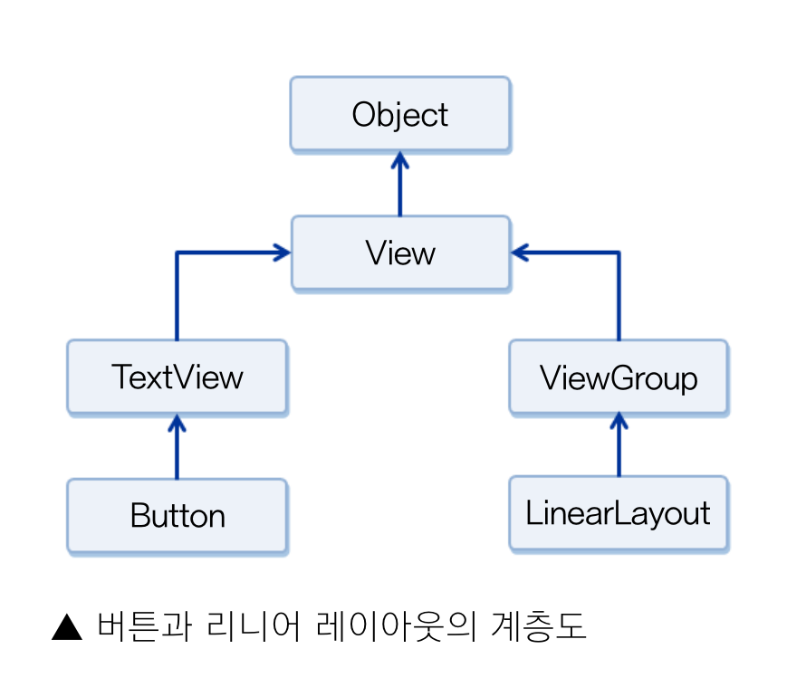


##### 3. 뷰의 크기 속성

> 뷰는 화면의 일정 영역을 차지하기 때문에 반드시 크기 속성이 있어야 한다

- `android:` 안드로이드의 기본 API에서 정의한 속성
- `layout_width` 뷰의 가로 크기
- `layout_height` 뷰의 세로 크기
  - `wrap_content` 뷰에 들어있는 내용물의 크기에 맞춤
  - `match_parent` 뷰를 담고 있는 뷰그룹에 맞춤
  - 숫자로 크기를 지정할 때는, dp나 px같은 단위를 함께 입력


#### 2.1.3 레이아웃 기초 익히기

- 제약 레이아웃 : 안드로이드 레이아웃의 기본 설정
  - Xcode의 화면 배치와 비슷한 방식
  - 단, 제약조건이 충분하게 다뤄지지 않으면 원하는 대로 만들어지지 않을 가능성이 더 높음


##### 1. 제약 조건 이해하기

> 뷰의 크기와 위치를 결정할 때 제약조건(Constraint)을 사용

- 제약조건 : 뷰가 레이아웃 안의 다른 요소와 어떻게 연결되는지 알려주는 조건
  - 뷰의 연결점(Anchor Point)과 대상(Target)을 연결함

- 방향 바이어스 : 한쪽으로 얼마나 치우쳐 있는지를 나타내는 속성 (%)
  - Vertical Bias : 위아래로
  - Horizontal Bias : 좌우로


##### 2. XML 원본에 추가된 속성 확인하기

- `<?xml version="1.0" encoding="utf-8"?>` 이 파일이 xml 형식임을 알려주는 코드라인
- `androidx.constraintlayout.widget.ConstraintLayout` 현재 xml의 레이아웃 방식
  - `xmlns:android` 안드로이드 기본 SDK에 포함되어 있는 속성
  - `xmlns:(app)` 외부 라이브러리(app)에 포함되어 있는 속성
  - `xmlns:tools` 안드로이드 스튜디오의 디자이너 도구 등에서 화면에 보여줄 때. 앱이 실행될 때는 적용되지 않고 안드로이드 스튜디오에서만

- `id` 뷰를 구분하는 구분자 역할
  - `@+id/아이디 값` 으로 정의하고 사용


##### 3. 크기를 표시하는 단위와 마진

| 단위        | 단위 표현                                       | 설명                                                         |
| ----------- | ----------------------------------------------- | ------------------------------------------------------------ |
| px          | 픽셀                                            | 화면 픽셀의 수                                               |
| dp 또는 dip | 밀도 독립적 픽셀<br>(density independent pixel) | 160dpi 화면을 기준으로 한 픽셀<br>예) 1인치 당 160개의 점이 있는 디스플레이 화면에서 1dp는 1px와 같음. 1인치 당 320개의 점이 있는 디스플레이 화면에서 1dp는 2px와 같음 |
| sp 또는 sip | 축척 독립적 픽셀<br>(scale idependent pixel)    | 텍스트 크기를 지정할 때 사용하는 단위. 가변 글꼴을 기준으로 한 픽셀로 dp와 유사하나 글꼴의 설정에 따라 1sp당 픽셀 수가 달라짐 |
| in          | 인치                                            | 1인치로 된 물리적 길이                                       |
| mm          | 밀리미터                                        | 1밀리미터로 된 물리적 길이                                   |
| em          | 텍스트 크기                                     | 글꼴과 상관없이 동일한 텍스트 크기 표시                      |


- dp나 dip는 해상도에 비례하는 비슷한 크기로 보이게 할 때 사용
- 해상도 별로 일일이 크기를 다시 지정하지 않아도 된다
- sp는 텍스트 크기를 지정할 때만 사용한다


### 2.2 레이아웃 익히기

#### 2.2.1 안드로이드에 포함된 대표적인 레이아웃 살펴보기

| 레이아웃 이름                   | 설명                                                         |
| ------------------------------- | ------------------------------------------------------------ |
| 제약 레이아웃(ConstraintLayout) | 제약 조건(Constraint) 기반 모델<br>제약 조건을 사용해 화면을 구성하는 방법<br>안드로이드 스튜디오에서 자동으로 설정하는 디폴트 레이아웃 |
| 리니어 레이아웃(LinearLayout)   | 박스(Box) 모델<br>한 쪽 방향으로 차례대로 뷰를 추가하여 화면을 구성하는 방법<br>뷰가 차지할 수 있는 사각형 영역을 할당 |
| 상대 레이아웃(RelativeLayout)   | 규칙(Rule) 기반 모델<br>부모 컨테이너나 다른 뷰와의 상대적 위치로 화면을 구성하는 방법<br>제약 레이아웃을 사용하게 되면서 상대 레이아웃은 권장하지 않음 |
| 프레임 레이아웃(FrameLayout)    | 싱글(Single) 모델<br>가장 상위에 있는 하나의 뷰 또는 뷰그룹만 보여주는 방법<br>여러 개의 뷰가 들어가면 중첩하여 쌓게 됨. 가장 단순하지만 여러 개의 뷰를 중첩한 후 각 뷰를 전환하여 보여주는 방식으로 자주 사용함 |
| 테이블 레이아웃(TableLayout)    | 격자(Grid) 모델<br>격자 모양의 배열을 사용하여 화면을 구성하는 방법<br>HTML에서 많이 사용하는 정렬 방식과 유사하지만 많이 사용하지는 않음 |


##### 1. 뷰의 배경색

```
[Format]

#RGB
#ARGB
#RRGGBB
#AARRGGBB
```


ARGB(A: Alpha, R: Red, G: Green, B: Blue)의 순서

A는 적지 않으면 100% 불투명도

00~99로 적으면 XX%의 불투명도를 갖는다


#### 2.2.2 리니어 레이아웃 사용하기

##### 1. 화면 생성 과정 분석하기

onCreate() 메서드 안에 setContentView() 메서드를 호출하는 부분이 있다.

setContentView() 메서드 안의 파라미터를 R.layout.activity_main과 같이 레이아웃으로 정의된 리소스를 가리키도록 설정하지 않고 자바 코드에서 만든 레이아웃 객체를 가리키도록 수정

XML 레이아웃에서 정의할 수 있는 대부분의 속성은 자바 소스 코드에서도 사용할 수 있도록 메서드로 제공

**new 연산자를 사용해서 뷰 객체를 코드에서 만들 때는 항상 Content 객체, this가 전달되어야 한다**

AppCompatActivity 클래스는 Context를 상속하므로 이 클래스 안에서는 this를 Context 객체로 사용할 수 있다

Context를 상속받지 않은 클래스에서 Context를 전달해야 한다면 getApplicationContext라는 메서드를 호출하여 앱에서 참조 가능한 Context 객체를 사용할 수 있다

자바 소스 코드에서 뷰를 만들어 뷰그룹에 추가할 때는 뷰 배치를 위한 속성을 설정할 수 있는 LayoutParams 객체를 사용

LayoutParams 객체를 새로 만들 때는 반드시 가로세로 속성 지정

소스 코드에서 레이아웃에 뷰를 추가하려면 addView() 메서드 사용


```java
@Override
protected void onCreate(Bundle savedInstanceState) {
    super.onCreate(savedInstanceState);

    // new 연산자로 리니어 레이아웃을 만들고 방향 설정
    LinearLayout mainLayout = new LinearLayout(this);
    mainLayout.setOrientation(LinearLayout.VERTICAL);

    // new 연산자로 레이아웃 안에 추가될 뷰들에 설정할 파라미터 생성
    LinearLayout.LayoutParams params =
        new LinearLayout.LayoutParams(
        LinearLayout.LayoutParams.MATCH_PARENT,
        LinearLayout.LayoutParams.WRAP_CONTENT
    );

    // 버튼에 파라미터 설정하고 레이아웃에 추가
    Button button1 = new Button(this);
    button1.setText("Button 1");
    button1.setLayoutParams(params);
    mainLayout.addView(button1);

    // 새로 만든 레이아웃을 화면에 설정
    setContentView(mainLayout);
}
```


##### 3. 뷰 정렬하기

> layoutgravity, gravity

| 정렬 속성 값      | 설명                                                         |
| ----------------- | ------------------------------------------------------------ |
| top               | 대상 객체를 위쪽 끝에 배치하기                               |
| bottom            | 대상 객체를 아래쪽 끝에 배치하기                             |
| left              | 대상 객체를 왼쪽 끝에 배치하기                               |
| right             | 대상 객체를 오른쪽 끝에 배치하기                             |
| center_vertical   | 대상 객체를 수직 방향의 중앙에 배치하기                      |
| center_horizontal | 대상 객체를 수평 방향의 중앙에 배치하기                      |
| fill_vertical     | 대상 객체를 수직 방향으로 여유 공간만큼 확대하여 채우기      |
| fill_horizontal   | 대상 객체를 수평 방향으로 여유 공간만큼 확대하여 채우기      |
| center            | 대상 객체를 수직 방향과 수평 방향의 중앙에 배치하기          |
| fill              | 대상 객체를 수직 방향과 수평 방향으로 여유 공간만큼 확대하여 채우기 |
| clip_vertical     | 대상 객체의 상하 길이가 여유 공간보다 클 경우에 남는 부분을 잘라내기<br>top\|clip_vertical로 설정한 경우 아래쪽에 남는 부분 잘라내기<br>bottom\|clip_vertical로 설정한 경우 위쪽에 남는 부분 잘라내기<br>center_vetical\|clip_vertical로 설정한 경우 위쪽과 아래쪽에 남는 부분 잘라내기 |
| clip_horizontal   | 대상 객체의 좌우 길이가 여유 공간보다 클 경우에 남는 부분을 잘라내기<br>right\|clip_horizontal로 설정한 경우 왼쪽쪽에 남는 부분 잘라내기<br>left\|clip_horizontal로 설정한 경우 오른쪽에 남는 부분 잘라내기<br>center_vetical\|clip_horizontal로 설정한 경우 왼쪽과 오른쪽에 남는 부분 잘라내기 |


##### 4. baselineAligned

> 텍스트 정렬 우선으로 하는 속성


#### 2.2.3 상대 레이아웃 사용하기

##### 1. 부모 컨테이너와의 상대적 위치를 이용해 뷰를 배치할 수 있는 속성

| 속성                     | 설명                                              |
| ------------------------ | ------------------------------------------------- |
| layout_alignParentTop    | 부모 컨테이너의 위쪽과 뷰의 위쪽을 맞춤           |
| layout_alignParentBotton | 부모 컨테이너의 아래쪽과 뷰의 아래쪽을 맞춤       |
| layout_alignParentLeft   | 부모 컨테이너의 왼쪽 끝과 뷰의 왼쪽 끝을 맞춤     |
| layout_alignParentRight  | 부모 컨테이너의 오른쪽 끝과 뷰의 오른쪽 끝을 맞춤 |
| layout_centerHorizontal  | 부모 컨테이너의 수평 방향 중앙에 배치함           |
| layout_centerVertical    | 부모 컨테이너의 수직 방향 중앙에 배치함           |
| layout_centerInParent    | 부모 컨테이너의 수평과 수직 방향 중앙에 배치함    |


##### 2. 다른 뷰와의 상대적 위치를 이용해 뷰를 배치할 수 있는 속성

| 속성                 | 설명                                                |
| -------------------- | --------------------------------------------------- |
| layout_above         | 지정한 뷰의 위쪽에 배치함                           |
| layout_below         | 지정한 뷰의 아래쪽에 배치함                         |
| layout_toLeftOf      | 지정한 뷰의 왼쪽에 배치함                           |
| layout_toRightOf     | 지정한 뷰의 오른쪽에 배치함                         |
| layout_alignTop      | 지정한 뷰의 위쪽과 맞춤                             |
| layout_alignBottom   | 지정한 뷰의 아래쪽과 맞춤                           |
| layout_alignLeft     | 지정한 뷰의 왼쪽과 맞춤                             |
| layout_alignBaseline | 지정한 뷰와 내용물의 아래쪽 기준선(baseline)을 맞춤 |


#### 2.2.4 테이블 레이아웃

1. TableLayout을 화면에 배치한다
2. TableRow를 TableLayout에 배치한다
   - height는 내부적으로 항상 wrap_content
   - weight는 항상 match_parent


#### 2.2.5 프레임 레이아웃과 뷰의 전환

> 뷰 중에서 하나의 뷰만 화면에 표시
>
> 나중에 쌓인 뷰일수록 먼저 보이게 됨

- visibility : 뷰를 보여줄지 보여주지 않을지 설정하는 속성


##### 1. 사용방법

1. FrameLayout을 추가하고, 내부에 원하는 뷰를 배치한다
   - 예시에서는 이미지뷰 2개를 배치했다
   - 처음에 배치된 뷰는 invisible, 마지막으로 배치된 뷰는 visible이 부여된다
2. 이미지뷰 2개를 객체로 가져온다
3. onClick 메서드로 두 이미지뷰의 visibility의 속성을 각각 invisible을 visible로, visible을 invisible로 바꾸도록 한다
   - 이미지뷰.setVisibility(View.INVISIBLE);


#### 2.2.6 스크롤뷰


## 3. 기본 위젯과 드로어블 사용하기

### 3.1 기본 위젯 다시 한 번 자세히 공부하기

#### 3.1.1 TextView

- text : 표시될 문자열

  ```xml
  <!-- /app/res/values/strings.xml -->
  <resurces>
  	<string name="app_name">SampleWidget</string>
      <string name="person_name">김진수</string>
  </resurces>
  ```

  - 이 파일을 TextView의 text 속성에서 `@string/person_name` 이라고 하면, 안드로이드 구동 시 `김진수`가 표시된다

- textColor : 텍스트 색상
- textSize : dp, sp, px 등의 단위를 사용하여 표시되는 텍스트의 크기 설정
  
  - sp 단위를 권장
- textStyle : 문자열의 스타일 속성. `|` 기호로 여러 개의 속성 값 지정 가능(공백 제거 필요)
  - normal
  - bold
  - italic

- typeFace : 문자열의 폰트
- maxLines : 문자열의 최대 줄 수. 해당 줄 제한을 넘는 텍스트는 표시되지 않는다


#### 3.1.2 ButtonView

##### 1. Radio Button

Radio Group 레이아웃을 추가하고 내부에 Button 뷰를 추가하면 된다


#### 3.1.3 EditTextView

> 입력상자의 역할. 사용자에게 값을 입력받을 때

- inputType : 입력하는 문자의 유형을 지정하는 속성


#### 3.1.4 ImageView

- `android:src` 또는 `app:srcCompat` : 원본 이미지를 설정
  - `@drawable/이미지 파일명`
- maxWidth, maxHeight : 최대 폭, 높이 설정. 설정하지 않으면 원본 이미지
- tint : 이미지의 색상
  - `#AARRGGBB` 포맷으로 적용
- scaleType : 이미지뷰의 크기에 맞게 원본 이미지의 크기를 자동으로 늘리거나 줄여서 보여줄 때의 속성
  - fitXY
  - centerCrop
  - centerInside


#### 3.1.5 텍스트뷰와 에디트텍스트의 다른 기능들

- 커서 관련 속성
  - selectAllOnFocus : true인 경우 포커스를 받을 때 문자열 전체가 선택됨
  - cursorVisible : false인 경우 커서가 보이지 않음
- 커서 관련 메서드
  - public int getSelectStart() : 선택된 영역의 시작 위치 반환
  - public int getSelectionEnd() : 선택된 영역의 끝 위치 반환
    - 위의 메서드 다 선택 영역이 없다면 현재 커서의 위치를 반환
  - public void setSelection(int start, int stop) : 선택 영역을 지정
  - public void selectAll() : 전체 문자열 선택
  - public void extendSelection(int index) : 선택 영역을 확장

- 자동 링크 관련 속성
  - autoLink : true로 설정하면 문서에 포함된 웹페이지 주소가 이메일 주소를 링크 색상으로 표시, 클릭시 웹페이지에 바로 접속
- 줄 간격 조정 관련 속성
  - lineSpacingMultiplier : 줄 간격을 기본 줄 간격의 배수로 설정
    - 기본 값을 1.0로 여기고 값 조절
  - lineSpacingExtra : 여유 값으로 설정
- 대소문자 표시 관련 속성
  - capitalize : 글자, 단어, 문장 단위로 대소문자 조절
    - characters : 글자 단위로 맨 앞글자를 대문자로 표시
    - words : 단어 단위로
    - sentences : 문장 단위로
- 줄임 표시 관련 속성
  - ellipsize : 입력한 내용의 생략 부분 설정
    - none (default) : 뒷부분을 자름
    - start : 앞을 자름
    - middle : 중간을 자름
    - end : 뒤를 자름
- 힌트 표시 관련 속성
  - hint
  - textColorHint
- 편집 가능 관련 속성
  - editable : false로 설정하면 에디트텍스트에 입력된 문자열 편집 불가
- 문자열 변경 처리 관련 메서드
  - public EditableObject getText() : 에디트텍스트에 입력된 문자를 확인하거나 입력된 문자가 필요한 포맷과 맞는지 확인할 때
    - 반환되는 Editable 객체에 toString() 메서드를 사용하면 문자열 확인 가능
  - public void addTextChangedListener(TextWatcher watcher) : 문자열이 사용자의 입력에 의해 바뀔 때마다 확인하는 리스너
    - public void beforeTextChanged(CharSequence s, int start, int count, int after)
    - public void afterTextChanged(Editable s)
    - public void onTextChanged(CharSequence s, int start, int before, int count)
  - setFilters() : 입력된 문자열의 길이를 확인하는 메서드
    - InputFilter 객체를 파라미터로 전달하고 이 객체의 LengthFilter() 메서드를 사용하면 입력될 문자열의 길이 설정 가능


### 3.2 드로어블 만들기

#### 3.2.1 뷰의 배경 이미지

- 뷰의 background 속성은 배경색을 설정하거나 이미지 파일을 설정할 때 사용
  - 아무런 변화를 주지 못하는 이미지
- 상태에 따라 그래픽이나 이미지가 선택적으로 보이게 해주는 드로어블


#### 3.2.2 드로어블

> 뷰에 설정할 수 있는 객체
>
> 그래픽을 그린다


| 드로어블                          | 설명                                                         |
| --------------------------------- | ------------------------------------------------------------ |
| 비트맵 드로어블(BitmapDrawable)   | 이미지 파일을 보여줄 때 사용함<br>비트맵 그래픽 파일(png, jpg, gif 등)을 사용해서 생성함 |
| 상태 드로어블(StateListDrawable)  | 상태별로 다른 비트맵 그래픽을 참조함                         |
| 전환 드로어블(TransitionDrawable) | 두 개의 드로어블을 서로 전환할 수 있음                       |
| 세이프 드로어블(ShapeDrawable)    | 색상과 그라데이션을 포함하여 도형 모양을 정의할 수 있음      |
| 인셋 드로어블(InsetDrawable)      | 지정된 거리만큼 다른 드로어블을 들어서 보여줄 수 있음        |
| 클립 드로어블(ClipDrawable)       | 레벨 값을 기준으로 다른 드로어블을 클리핑할 수 있음          |
| 스케일 드로어블(ScaleDrawable)    | 레벨 값을 기준으로 다른 드로어블의 크기를 변경할 수 있음     |


##### 1. 상태 드로어블 만들기

```xml
<!-- app/res/drawable/finger_drawable.xml -->
<?xml version="1.0" encoding="utf-8"?>
<selector xmlns:android="http://shemas.android.com/apk/res/android">
	<item android:state_pressed="true"
          android:drawable="@drawable/눌렸을때보여줄이미지이름" />
    <tiem android:drawable="@drawable/안눌렸을때보여줄이미지이름" />
</selector>
```

이 xml파일을 버튼뷰(text 속성을 제거한)의 background 속성으로 설정

`@drawable/안눌렸을때보여줄이미지이름`


##### 2. 세이프 드로어블 만들기

```xml
<!-- app/res/drawable/rect_drawable.xml -->
<?xml version="1.0" encoding="utf-8"?>
<shape xmlns:android="http://shemas.android.com/apk/res/android"
    android:shape="rectangle">	<!-- oval은 타원 -->
    
    <size android:width="200dp" android:height="120dp" />
    <stroke android:width="1dp" android:color="#0000ff" />
    <solid android:color="#aaddff" />
    <padding android:bottom="1dp" />
</shape>
```

rect_drawable.xml을 이용해서 background를 설정한 button을 만들면 네모난 버튼 생성


```xml
<!-- app/res/drawable/back_drawable.xml -->
<?xml version="1.0" encoding="utf-8"?>
<shape xmlns:android="http://shemas.android.com/apk/res/android">
    
    <gradient
          android:startColor="#7288DB"
          android:centerColor="#3250B4"
          android:endColor="#254095"
          android:angle="90"
          android:centerY="0.5"
    />
    
    <corners android:radius="2dp" />
    
</shape>
```

activity_main.xml의 최상위 레이아웃의 background 속성값을 `@drawable/back_drawable`로 설정


```xml
<!-- app/res/drawable/border_drawable.xml -->
<?xml version="1.0" encoding="utf-8"?>
<layer-list xmlns:android="http://shemas.android.com/apk/res/android">
    
    <item>
    	<shape android:shape="rectangle">
        	<stroke android:width="1dp" android:color="#BE55DA" />
            <solid android:color="#00000000" />	<!-- 투명 배경 -->
            <size android:width="200dp" android:height="100dp" />
        </shape>
    </item>
    
    <item android:top="1dp" android:bottom="1dp"
          android:right="1dp" android:left="1dp">
    	<shape android:shape="rectangle">
        	<stroke android:width="1dp" android:color="#FF55DA" />
            <solid android:color="#00000000" />
        </shape>
    </item>
    
</layer-list>
```

이를 이용하여 button 생성


### 3.3 이벤트 처리 이해하기

#### 3.3.1 이벤트 처리 방식

- 터치 이벤트(Touch Event)
- 실제 버튼이나 소프트 키를 누르면 발생하는 키 이벤트(Key Event)


##### 1. 클릭 이벤트

> 클릭할 때 이벤트

- setOnClickListener()
  - boolean onTouchEvent (MotionEvent event)
  - boolean onKeyDown (int keyCode, KeyEvent event)
  - boolean onKeyUp (int keyCode, KeyEvent event)

- 뷰의 일반적인 리스너

  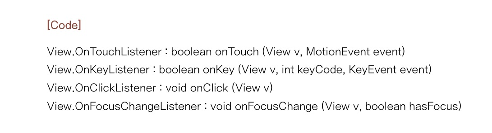


##### 2. 제스처 이벤트

| 메서드                 | 이벤트 유형                                                  |
| ---------------------- | ------------------------------------------------------------ |
| onDown()               | 화면이 눌렸을 경우                                           |
| onShowPress()          | 화면이 눌렸다 떼어지는 경우                                  |
| onSingleTapUp()        | 화면이 한 손가락으로 눌렸다 떼어지는 경우                    |
| onSingleTapConfirmed() | 화면이 한 손가락으로 눌려지는 경우                           |
| onDoubleTap()          | 화면이 두 손가락으로 눌려지는 경우                           |
| onDoubleTapEvent()     | 화면이 두 손가락으로 눌려진 상태에서 떼거나 이동하는 등 세부적인 액션을 취하는 경우 |
| onScroll()             | 화면이 눌린 채 일정한 속도와 방향으로 움직였다 떼는 경우     |
| onFling()              | 화면이 눌린 채 가속도를 붙여 손가락을 움직였다 떼는 경우     |
| onLongPress()          | 화면을 손가락으로 오래 누르는 경우                           |


- onTouch(MotionEvent event)
  - MotionEvent.ACTION_DOWN : 손가락이 눌렀을 때
  - MotionEvent.ACTION_MOVE : 손갈가 눌린 상태로 움직일 때
  - MotionEvent.ACTION_UP : 손가락이 떼졌을 때


##### 3. 키 이벤트

- boolean onKeyDown (int keyCode, KeyEvent event)

- boolean onKey (View v, int keyCode, KeyEvent event)

  - OnKeyyListener 인터페이스를 구현할 때 사용

  - keyCode

    | 키 코드               | 설명                |
    | --------------------- | ------------------- |
    | KEYCODE_DPAD_LEFT     | 왼쪽 화살표         |
    | KEYCODE_DPAD_RIGHT    | 오른쪽 화살표       |
    | KEYCODE_DPAD_UP       | 위쪽 화살표         |
    | KEYCODE_DPAD_DOWN     | 아래쪽 화살표       |
    | KEYCODE_DPAD_CENTER   | 중앙 버튼           |
    | KEYCODE_CALL          | 통화 버튼           |
    | KEYCODE_ENDCALL       | 통화 종료 버튼      |
    | KEYCODE_VOLUME_UP     | 소리 크기 증가 버튼 |
    | KEYCODE_VOLUME_DOWN   | 소리 크기 감소 버튼 |
    | KEYCODE_0 ~ KEYCODE_9 | 0부터 9까지의 키 값 |
    | KEYCODE_A ~ KEYCODE_Z | A부터 Z까지의 키 값 |
    | KEYCODE_CAMERA        | 카메라 미리보기     |

  - KEYCODE_BACK : 시스템 뒤로가기 버튼

    - void onBackPressed() : 뒤로가기 버튼 클릭 시 실행되는 메서드


##### 4. 화면 방향 전환 이벤트

> 단말 방향이 변경되는 경우, 액티비티는 메모리에서 없어졌다가 다시 생성된다

| 단말기 방향 | 동작 폴더(파일)                    |
| ----------- | ---------------------------------- |
| 세로        | /res/layout/activity_main.xml      |
| 가로        | /res/layout-land/activity_main.xml |

- 세로 방향에서 activity_main.xml을 사용하는 경우, 단말기 방향이 바뀌면 우선 layout-land 폴더에 있는 activity_main.xml을 사용한다

- 단말의 방향이 바뀌면, 액티비티가 소멸된 후 다시 생성되므로 이전의 변수 값들이 사라진다는 문제가 있다
  - VerHoriScreenChange 앱을 보자
  - onSaveInstanceState() : 콜백 메서드. 액비티비가 종료되기 전의 상태를 저장.
    - 이 상태를 onCreate() 메서드가 호출될 때 전달되는 번들 객체로 복원 가능
    - 액티비티가 하나만 실행된다는 점을 이용, id를 같게 부여해도 된다

- 액티비티는 바뀌지 않고 단순히 화면에 보이는 레이아웃만 바꾸는 방법

  - 방향이 바뀌는 이벤트를 앱에 전달한 다음, 기능이 동작하도록 한다

  - manifest에 액티비티를 등록할 때 configChanges 속성을 설정

  - VerHoriScreenChange2 앱을 보자

    ```xml
    <!-- app/manifests/AndroidManifest.xml -->
    
    <activity android:name=".MainActivity"
              android:configChanges="orientation|screenSize|keyboardHidden">
        <intent-filter>
            <action android:name="android.intent.action.MAIN" />
    
            <category android:name="android.intent.category.LAUNCHER" />
        </intent-filter>
    </activity>
    ```

    - configChanges 속성 값이 설정되면 액티비티의 상태 변화를 액티비티 쪽으로 알려주기만 하므로 개발자가 각각 상태에 따른 대응 코드를 작성
    - `orientation|screenSize|keyboardHidden`는 단말의 방향이 바뀔 때마다 액티비티에서 인식할 수 있으며, 단말이 바뀌는 시점에 configurationChanged() 메서드가 자동으로 호출
      - keyboardHidden 값은 액티비티가 보일 때 키패드가 자동으로 나타나지 않도록 하고 키패드가 보여야 할 시점을 액티비티 쪽에 알려주기만 함

    ```java
    package com.ssafy.verhoriscreenchange2;
    
    import androidx.annotation.NonNull;
    import androidx.appcompat.app.AppCompatActivity;
    
    import android.content.res.Configuration;
    import android.os.Bundle;
    import android.widget.Toast;
    
    public class MainActivity extends AppCompatActivity {
    
        @Override
        protected void onCreate(Bundle savedInstanceState) {
            super.onCreate(savedInstanceState);
            setContentView(R.layout.activity_main);
        }
    
    
        @Override
        public void onConfigurationChanged(@NonNull Configuration newConfig) {
            super.onConfigurationChanged(newConfig);
    
            // if 가로 방향으로 전환할 때 처리 else if 세로 방향으로 전환할 때 처리 
            if (newConfig.orientation == Configuration.ORIENTATION_LANDSCAPE) {
                showToast("방향 : ORIENTATION_LANDSCAPE");
            } else if (newConfig.orientation == Configuration.ORIENTATION_PORTRAIT) {
                showToast("방향 : ORIENTATION_PORTRAIT");
            }
        }
    
    
        public void showToast(String data) {
            Toast.makeText(this, data, Toast.LENGTH_SHORT).show();
        }
    }
    ```

- 애플리케이션 방향을 세로 또는 가로로 고정하고 싶다면 manifest 파일에서 액티비티의 screenOrientation 속성 값을 지정

  - 가로방향 landscape


#### 3.3.2 토스트, 스낵바, 대화상자


##### 1. 토스트

```java
Toast.makeText(Context context, String message, int duration).show()
```

- public void setGravity(int gravity, int xOffset, int yOffset)
- public void setMargin(float horizontalMargin, float verticalMargin)

- xml 파일로 모양 바꾸기

  ```java
  public void onButtonShowToast(View v) {
      // 레이아웃 인플레이터 객체 참조
      LayoutInflater inflater = getLayoutInflater();
      
      
      // 토스트를 위한 레이아웃 인플레이션
      View layout = inflater.inflate(R.layout.toastborder, (ViewGroup)findViewById(R.id.toast_layout_root));
      
      TextView text = layout.findViewById(R.id.text);
      
      
      // 토스트 객체 생성
      Toast toast = new Toast(this);
      text.setText("모양 바꾼 토스트");
      toast.setGravity(Gravity.CENTER, 0, -100);
      toast.setDuration(Toast.LENGTH_SHORT);
      
      
      // 토스트의 모양을 결정할 뷰 설정
      toast.setView(layout);
      toast.show();
  }
  ```

  


##### 2. 스낵바

- 팔레트의 containers 그룹의 AppBarLayout을 설치

- MainActivity.java

  ```java
  public void onButtonShowSnackBar(View v) {
      Snackbar.make(v, "스낵바입니다", Snackbar.LEGNTH_LONG).show();
  }
  ```

  


## 4. 여러 화면 간 전환하기

### 4.1 레이아웃 인플레이션 이해하기

- setContentView() 메서드는 액티비티의 화면 전체를 설정하는 역할만을 수행

- 부분 화면을 메모리에 객체화 하려면 인플레이터를 사용

  - LayoutInflater는 getSystemService() 메서드를 이용하여 LayoutInflater 객체를 참조한 후 사용

  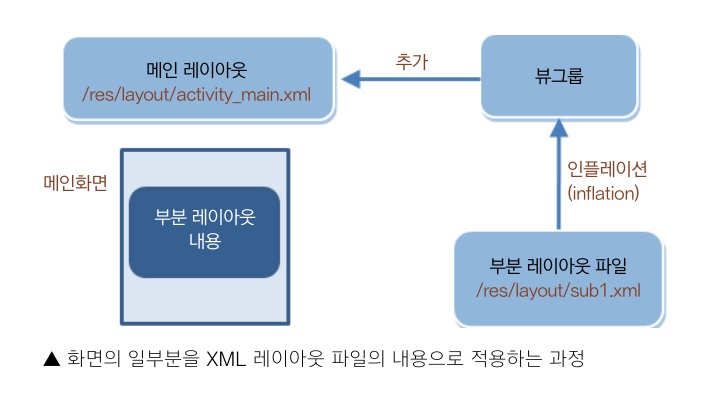

  - SmallActivityOnMainActivity 참조

  - View inflate(int resource, ViewGroup root)
    - xml 레이아웃 리소스
    - 부모 컨테이너
  - static LayoutInflater LayoutInflater.from(Context context)


### 4.2 여러 화면 간 전환하기

#### 4.2.1 안드로이드 앱의 네 가지 구성 요소

1. 액티비티(Activity)
2. 서비스(Service)
3. 브로드캐스트 수신자(Broadcast Receiver)
4. 내용 제공자(Content Provider)


#### 4.2.2 ManyActivityChange 참조

##### 1. manifests.xml

- `android:label` 화면의 제목 설정
- `android:theme` 테마를 설정
  - `@style/Theme.AppCompat.Dialog` 대화상자 형태 테마


##### 2. MenuActivity.java

- `setResult(응답 코드, 인텐트)` 새로 띄운 액티비티에서 이전 액티비티로 인텐트를 전달할 때
- `finish()` 액티비티를 화면에서 없앨 때


##### 3. MainActivity.java

- startActivityForResult(intent, REQUEST_CODE_MENU);

  - REQUEST_CODE_MENU는 새 액티비티를 띄울 때 보낼 요청 코드

    - 코드의 값은 중복되지 않는 int형 값으로 마음대로 지정

    - 이 값은 나중에 새 액티비티로부터 응답을 받을 때 다시 전달받음

      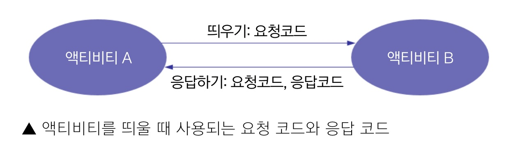

- Intent(Context, ActivityClassInstance)
  
- 일반적으로 Context로는 this를 사용하지만 이벤트 처리 메서드 안에서 this 변수로 현재 Activity 객체를 참조할 수 없을 경우, getApplicationContext()를 사용
  
- protected void onActivityResult(int requestCode, int resultCode, intent intent)
  - requestCode : 액티비티를 전달했던 요청 코드
  - resultCode : 새 액티비티로부터 전달된 응답 코드
    - 새 액티비티에서 처리한 결과가 정상인지 아닌지 구분하는 용도
    - 보통 Activity.RESULT_OK를 전달하여 정상임을 알림
  - intent : 새 액티비티로부터 전달받은 인텐트
    - 주로 새 액티비티로부터 원래 액티비티로 데이터를 전달할 때 사용
    - putExtra(Key, Value) : 인텐트 객체에 데이터를 넣는 방법


### 4.3 인텐트

#### 4.3.1 인텐트의 역할과 사용 방식


##### 1. 다른 앱 구성 요소에 인텐트를 전달할 수 있는 메서드

- startActivity() 또는 startActivityForResult() : 액티비티를 화면에 띄울 때
- startService() 또는 bindService() : 서비스를 시작할 때
- broadcastIntent() : 인텐트 객체를 브로드캐스팅 방식으로 전송할 때


##### 2. 인텐트의 기본 구성 요소는 액션(Action)과 데이터(Data)

- 액션은 수행할 기능
- 데이터는 수행될 대상의 데이터


| 속성                                    | 설명                                                         |
| --------------------------------------- | ------------------------------------------------------------ |
| ACTION_DIAL tel:01077881234             | 주어진 전화번호를 이용해 전화걸기 화면을 보여줌              |
| ACTION_VIEW tel:01077881234             | 주어진 전화번호를 이용해 전화걸기 화면을 보여줌<br>URI 값의 유형에 따라 VIEW 액션이 다른 기능을 수행함 |
| ACTION_EDIT content://contacts/people/2 | 전화번호부 데이터베이스에 있는 정보 중에서<br>ID 값이 2인 정보를 편집하기 위한 화면을 보여줌 |
| ACTION_VIEW content://contacts/people   | 전화번호부 데이터베이스의 내용을 보여줌                      |


#### 4.3.2 인텐트 생성자

- Intent()
- Intent(Intent o)
- Intent(String action [, Uri uri])
- Intent(Context packageContext, Class<?> cls)
- Intent(String action, Uri uri, Context packageContext, Class<?> cls)


##### 1. 범주(Category)

액션이 실행되는 데 필요한 추가적인 정보 제공

- CATEGORY_LAUNCHER : 애플리케이션 런처 화면에 이 앱을 보여주어야 한다


##### 2. 타입(Type)

인텐트에 들어가는 데이터의 MIME 타입을 지정


##### 3. 컴포넌트(Component)

인텐트에 사용될 컴포넌트 클래스 이름 지정


##### 4. 부가 데이터(Extra Data)

SampleCallIntent 참조


### 4.4 플래그와 부가 데이터 사용

액티비티로 만든 화면이 한번 메모리에 만들어졌는데 계속 startActivity()를 호출하면 동일한 액티비티가 계속 메모리에 생성될 것

이런 문제를 해결하기 위한 플래그


#### 4.4.1 플래그

##### 1. 액티비티 처리 방식

- 액티비티 스택의 처리 과정

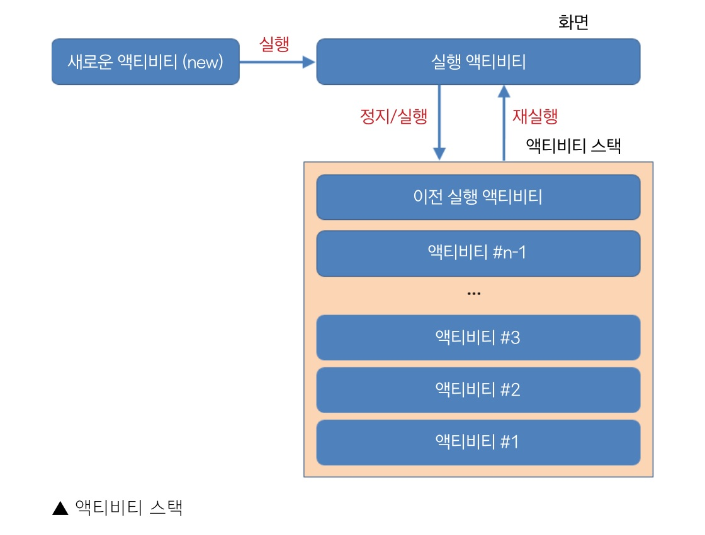


##### 2. 대표적인 플래그

- FLAG_ACTIVITY_SINGLE_TOP : 이미 생성된 액티비티가 있으면 그 액티비티를 그대로 사용
  - 액티비티를 그대로 사용하는 경우, onCreate() 메서드는 실행되지 않는다
- FLAG_ACTIVITY_NO_HISTORY : 처음 이후 실행된 액티비티는 액티비티 스택에 추가하지 않음
- FLAG_ACTIVITY_CLEAR_TOP : 이 액티비티 위에 있는 다른 액티비티를 모두 종료
  - 애플리케이션의 홈 화면 등을 만들 때


##### 3. 부가 데이터

- 액티비티를 띄울 때 전달되는 인텐트 안에 부가데이터(Extra data)를 넣어 전달하는 방법을 권장

- 인텐트 안에는 번들(Bundle) 객체가 들어 있다

  - 번들 객체는 해시 테이블과 유사
  - putExtra()와 get자료형Extra() 메서드로 데이터를 넣거나 뺄 수 있다

  - Intent putExtra(String name, String value)
    - 2번째 인자로 int Value, boolean value 가능
  - String getStringExtra(String name)
    - name을 key로 갖는 value 반환
  - int getIntExtra(String name, int defaultValue)
    - 해당하는 name의 value가 존재하지 않으면 defaultValue 반환
  - boolean getBooleanExtra(String name, boolean defaultValue)
  - 기본 자료형이 아닌 객체(Object) 자료형은 전달할 수 없다
    - 바이트 배열로 변환하거나 Serializable 인터페이스를 구현하는 객체를 만들어 직렬화 하여 전달
    - 안드로이드는 Parcelable 인터페이스를 권장
      - public abstract int describeContents() : 직렬화하려는 객체의 유형 구분
      - public abstract void writeToParcel(Parcel dest, int flags) : 객체가 갖고 있는 데이터를 Parcel 객체로 만들어줌
        - Parcel 객체는 read자료형()와 write자료형() 형태의 메서드 제공
      - CREATOR 상수 : Parcel 객체로부터 데이터를 읽어들여 객체를 생성하는 역할


#### 4.4.2 SampleParcelable 참조

##### 1. SimpleData.java

- SimpleData 클래스는 Parcelable 인터페이스를 구현
- SimpleData 객체는 문자열과 정수로 구성된 객체
- writeToParcel() 메서드는 SimpleData 객체 안에 들어있는 데이터를 Parcel 객체로 만드는 역할

- CREATOR 객체는 상수로 정의
  - new SimpleData(in)으로 SimpleData 객체를 만듦
  - SimpleData 클래스 안에 Parcel 객체의 데이터를 읽는 부분과 Parcel 객체로 쓰는 부분 정의


##### 2. MainActivity

- new SimpleData(숫자, 문자열)로 Parcel 객체 생성
- putExtra() 메서드로 SimpleData 객체를 추가하여 MenuActivity에 전달


##### 3. MenuActivity

- getIntent() 메서드로 MainActivity로부터 전달받은 인텐트 참조
- getExtras() 메서드로 Bundle 자료형 객체 반환
  - 반환 없이 인텐트 객체의 get자료형Extra() 메서드 사용 가능
- getParcelable() 메서드로 객체를 참조한 후 화면에 보여주기


### 4.5 태스크 관리

> 전화 앱을 실행하는 개인 앱을 만든 경우,
>
> 개인 앱을 실행하면 해당 앱은 하나의 프로세스 위의 가상 머신 위에서 동작한다.
>
> 개인 앱에서 시스템으로 인텐트를 보내서 전화 앱을 실행하면 전화 앱은 또 다른 프로세스에서 동작한다.
>
> 따라서 전화 앱에서 시스템 Back 키를 눌러도 개인 앱으로 돌아오지 않는다.
>
> 왜냐하면 개인 앱과 전화 앱이 실행되는 프로세스가 다르기 때문이다.


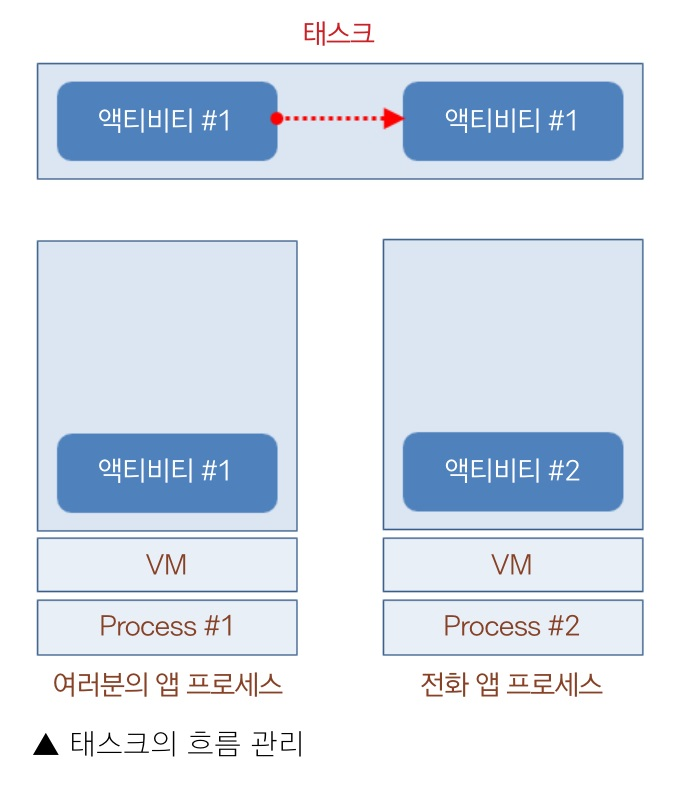


#### 4.5.1 프로세스와 태스크

##### 1. 태스크

액티비티의 각종 정보를 저장하기 위한 장치


#### 4.5.2 SimpleTask 참조

- 새로 뜨는 화면을 차례대로 스택에 넣어서 관리


##### 1. Manifest.xml

- launchMode 속성
  - singleTop : 가장 위쪽에 있는 액티비티는 더 이상 새로 만들지 않음
    - FLAG_ACTIVITY_SINGLE_TOP
  - singleTask : 액티비티가 실행되는 시점에 새로운 태스크 생성
  - singleInstance : 액티비티가 실행되는 시점에 새로운 태스크 생성, 이후 실행되는 액티비티들은 이 태스크를 공유하지 않음


## 5. 프래그먼트

### 5.1 프래그먼트란?

> 화면의 일부분을 다른 화면으로 구성하고 싶을 때는?
>
> 즉, 전체 화면 안에 부분 화면을 만들어 넣은 경우

#### 5.1.1 프래그먼트에 대해 이해하기

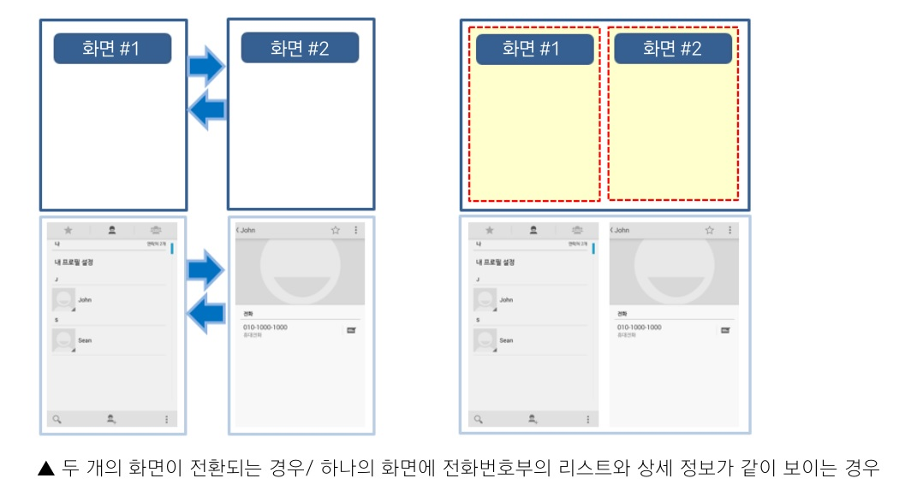

- 프래그먼트 : 오른쪽 그림처럼 하나의 화면을 여러 부분으로 나눠서 보여주거나 각각의 부분 화면 단위로 바꿔서 보여주고 싶을 때 사용하는 것


##### 1. 프래그먼트 사용 목적

- 분할된 화면들을 독립적으로 구성하기 위해 사용
- 분할된 화면들의 상태를 관리하기 위해 사용


##### 2. 프래그먼트 동작 방식

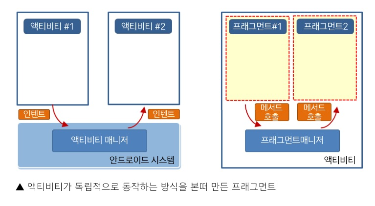


- 프래그먼트는 항상 액티비티 위에 있어야 한다
  - 액티비티로 만든 화면을 분할한 뒤 각각의 부분 화면을 프래그먼트로 만들고 그 프래그먼트를 독립적으로 관리하는 것이 목표
  - 프래그먼트가 제대로 동작하는 시점은 프래그먼트가 액티비티에 올라가는 시점
- 왼쪽 그림은 액티비티가 동작하는 방식
  - 액티비티는 안드로이드 시스템에서 관리
  - 액티비티 매니저가 액티비티의 동작 순서나 처리 방식을 결정
  - 인텐트를 통해 시스템이 이해하는 형식으로 명령, 데이터를 전달
- 오른쪽 그림은 프래그먼트가 동작하는 방식
  - 안드로이드 시스템이 하는 일을 액티비티가 함
  - 프래그먼트 매니저가 프래그먼트 관리
  - 액티비티와 프래그먼트 간에 데이터를 전달할 때는 메서드를 통해서
- 프래그먼트는 액티비티 위에 하나만 올라가 있어도 된다
  - 이렇게 하면 원하는 시점에 하나의 프래그먼트를 다른 프래그먼트로 바꿔서 보여줄 수도 있다


#### 5.1.2 프래그먼트를 화면에 추가하는 방법

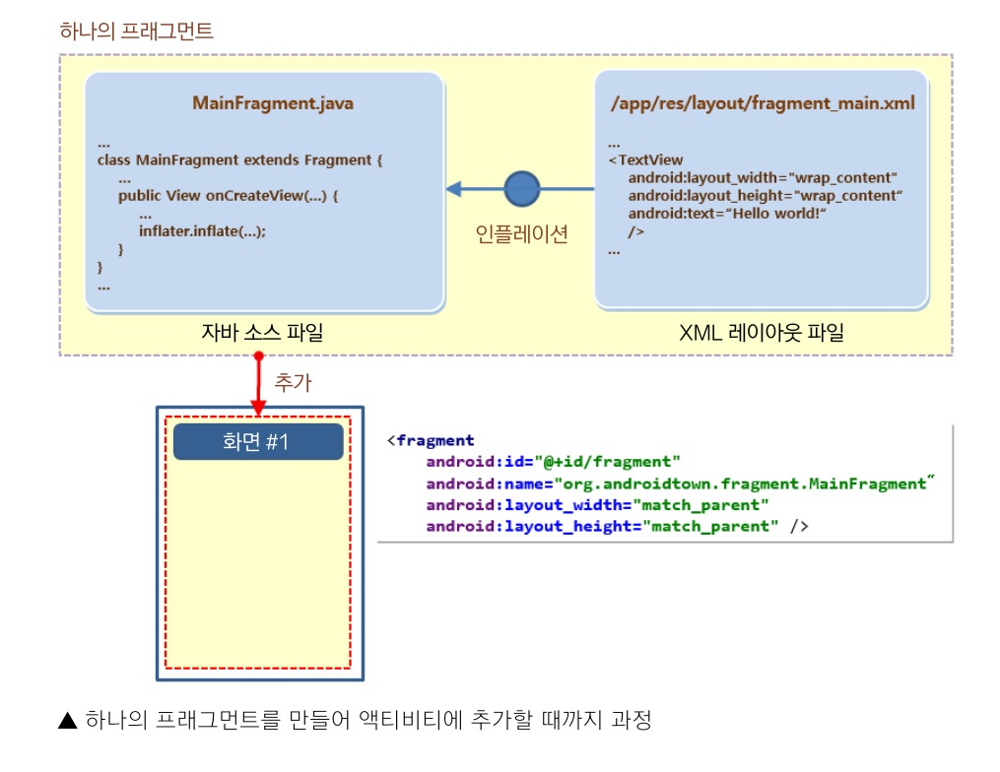

- 부분 화면을 독립적으로 사용하기 위해서 액티비티를 본 뜬 프래그먼트
- 프래그먼트도 하나의 XML 레이아웃과 하나의 자바 소스 파일로 동작

1. 프래그먼트를 위한 뷰 배치를 설정한 XML 레이아웃 생성
2. 프래그먼트를 위한, Fragment 클래스를 상속한 자바 소스
3. 주요 메서드
   - public final Activity getActivity() : 이 프래그먼트를 포함하는 액티비티를 반환
   - public final FragmentManager getFragmentManager() : 이 프래그먼트를 포함하는 액티비티에서 프래그먼트 객체들과 의사소통하는 프래그먼트 매니저를 반환
   - public final Fragment getParentFragment() : 이 프래그먼트를 포함하는 부모가 프래그먼트일 경우 리턴, 액티비일 경우 null을 반환
   - public final int getId () : 이 프래그먼트의 ID를 반환

4. setContentView() 대신 LayoutInflater를 사용해 인플레이션
   - onCreateView()는 인플레이션이 필요한 시점에 자동으로 호출
     - inflate()를 호출하도록 두면 인플레이션 후 프래그먼트가 뷰처럼 동작
5. 새로 만든 프래그먼트는 뷰와 마찬가지로 XML 레이아웃에 추가하거나 소스코드에서 new 연산자자로 객체를 만든 후 프래그먼트 매니저로 메인 액티비티에 추가
   - 메인 화면을 위해 만든 acitivity_main.xml 파일에 직접 `<fragment>` 태그로 추가
   - 새로 정의한 프래그먼트 클래스의 객체를 new 연산자로 만든 후 FragmentManager 객체의 add() 메서드를 사용해 액티비티에 추가
     - public abstract FragmentTransaction beginTransaction () : 프래그먼트를 변경하기 위한 트랜잭션 시작
     - public abstract Fragment findFragmentById (int id) : ID를 이용해 프래그먼트 객체를 찾음
     - public abstract Fragment findFragmentByTag (String tag) : 태그 정보를 사용해 프래그먼트 객체를 찾음
     - public abstract boolean executePendingTransaction () : 트랜잭션은 commit() 메서드를 호출하면 실행되지만 비동기 방식으로 실행되므로 즉시 실행하고 싶은 경우 추가로 호출하는 메서드
   - FragmentManager 객체는 프래그먼트를 액티비티에 추가(add), 다른 프래그먼트로 바꾸거나(replace) 또는 삭제(remove)할 때 주로 사용할 수 있다
     - getFragmentManager() 메서드를 호출하여 참조할 수 있다


##### 1. 프래그먼트의 특성

| 특성          | 설명                                                         |
| ------------- | ------------------------------------------------------------ |
| 뷰 특성       | 뷰그룹에 추가되거나 레이아웃의 일부가 될 수 있음<br>뷰에서 상속받은 것은 아니며 뷰를 담고 있는 일종의 틀 |
| 액티비티 특성 | 액티비티처럼 수명주기(Lifecycle)를 갖고 있음<br>컨텍스트 객체는 아니며 라이프사이클은 액티비티에 종속 |


#### 5.1.3 프래그먼트를 만들어 화면에 추가하기

#### SampleFragment 참조

```
프래그먼트를 만들어 사용하는 과정

1. 프래그먼트를 위한 XML 레이아웃 만들기
2. 프래그먼트 클래스 만들기
3. 액티비티를 XML 레이아웃에 추가하기
```

```
화면에 뷰를 추가하는 방법 2가지
1. XML 레이아웃에 추가하는 방법
2. 자바 소스 코드로 추가하는 방법
```


##### 1. xml 파일 간단히 설정

##### 2. MainFragment.java 파일의 onCreateView() 메서드 이외의 코드 제거

- onCreateView() 메서드의 파라미터로 LayoutInflater 객체가 전달되므로 inflate() 메서드 호출 가능
  - inflate() 메서드로 전달되는 첫 번째 파라미터는 XML 레이아웃 파일
  - 두 번째 파라미터는 XML 레이아웃이 설정될 뷰그룹 객체
    - onCreateView() 메서드로 전달되는 두 번째 파라미터가 현재 프래그먼트의 최상위 레이아웃이므로 이를 전달
- inflate() 호출 시 인플레이션 진행 후 ViewGroup 객체가 return을 통해 반환

##### 3. MainActivity.xml에 fragment 태그 추가

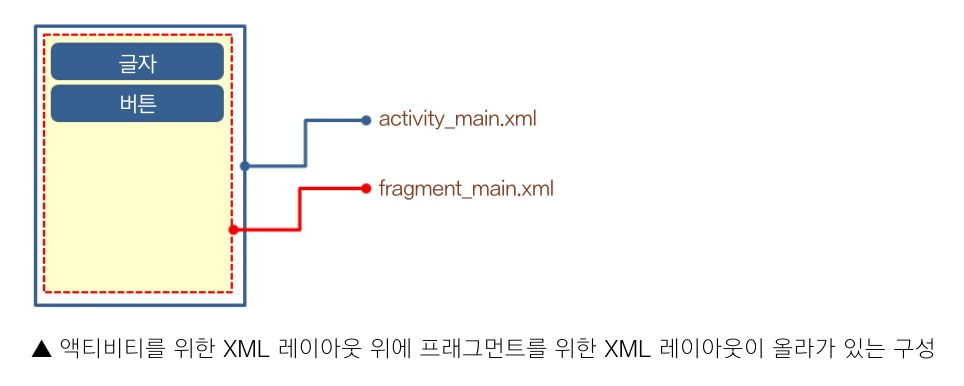


##### 4. 버튼 클릭했을 때 코드에서 프래그먼트 추가

- fragment_menu는 xml파일과 소스 파일로 프래그먼트를 추가해보는 방법 적용


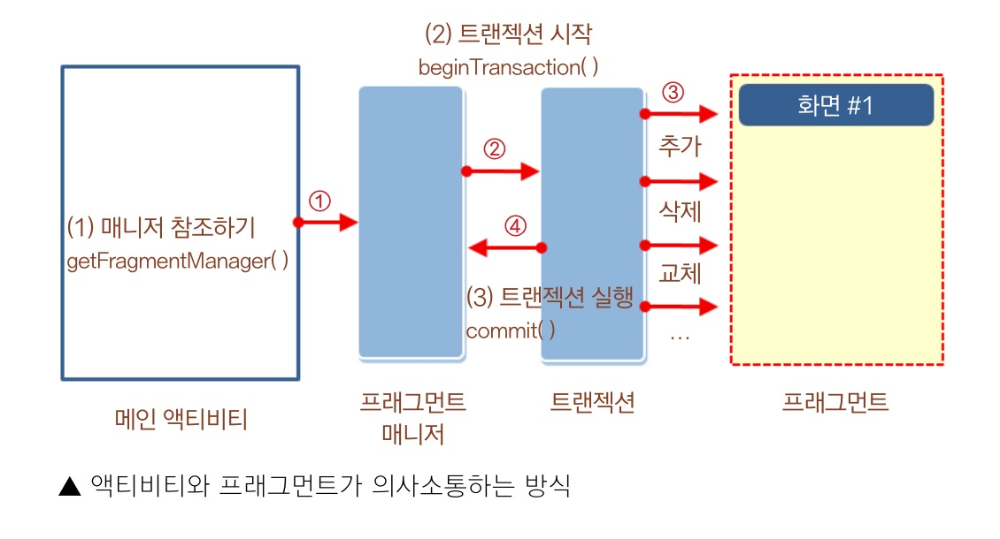


##### 5. 프래그먼트의 수명주기

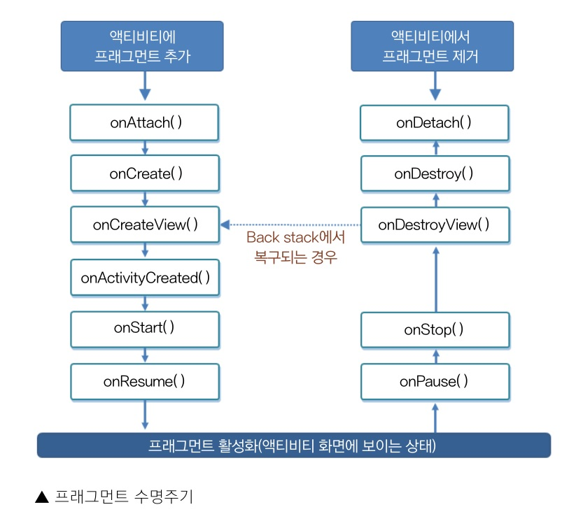

| 메서드                                          | 설명                                                         |
| ----------------------------------------------- | ------------------------------------------------------------ |
| onAttach(Activity)                              | 프래그먼트가 액티비티와 연결될 때 호출됨                     |
| onCreate(Bundle)                                | 프래그먼트가 초기화될 때 호출됨<br>(new 연산자를 이용해 새로운 프래그먼트 객체를 만드는 시점이 아니다) |
| onCreateView(LayoutInflater, ViewGroup, Bundle) | 프래그먼트와 관련되는 뷰 계층을 만들어서 리턴                |
| onActivityCreated(Bundle)                       | 프래그먼트와 연결된 액티비티가 onCreate() 메서드의 작업을 완료했을 때 호출 |
| onStart()                                       | 프래그먼트와 연결된 액티비티가 onStart() 되어 사용자에게 프래그먼트가 보일 때 호출 |
| onResume()                                      | 프래그먼트와 연결된 액티비티가 onResume() 되어 사용자와 상호작용 할 수 있을 때 호출 |


| 메서드          | 설명                                                         |
| --------------- | ------------------------------------------------------------ |
| onPause()       | 프래그먼트와 연결된 액티비티가 onPause() 되어 사용자와 상호작용을 중지할 때 호출됨 |
| onStop()        | 프래그먼트와 연결된 액티비티가 onStop() 되어 화면에서 더 이상 보이지 않을 때나 프래그먼트의 기능이 중지되었을 때 호출됨 |
| onDestroyView() | 프래그먼트와 관련된 뷰 리소스를 해제할 수 있도록 호출        |
| onDestroy()     | 프래그먼트의 상태를 마지막으로 정리할 수 있도록 호출         |
| onDetach()      | 프래그먼트가 액티비티와 연결을 끊기 바로 전에 호출           |

